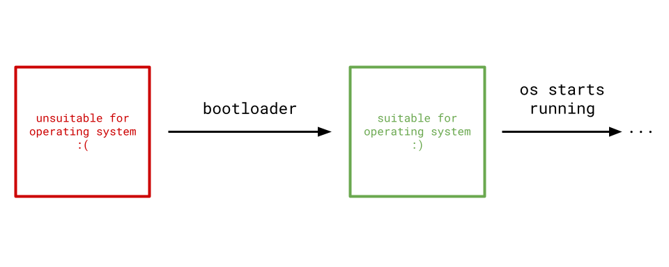

> ❓ **Is there a source code reference for this blog?**
>
> The final source code at the end of every blog post can be found within the `scratch_os-blog-src/` directory within this blog's [GitHub Repository](https://github.com/sumandas27/scratchOS-Blog) to be used as a reference as you read through the blog.

# Introduction

Let's make an operating system in Rust. An *operating system* is the layer of abstraction between a computer's hardware and software.

  

It allows users like you and I to utilize the fullest potential of their computer's hardware without worrying about the inner details of the hardware. This is a very broad definition because the operating system is responsible for a broad range of tasks like memory, processes, networking, concurrency, etc.

Our goal will be to write an operating system in Rust *without any dependencies*! Just Rust and its core library (thus the name scratchOS, we're writing this *kind of* from scratch). This probably isn't feasable for industry-level operating systems, but is great to learn about embedded programming as you get to build everything from the bottom up.

## How Does an Operating System Run?

When a machine is first powered on, it is generally not in a suitable state for a legitimate operating system. It is the *bootloader's job* to morph the state of the machine's hardware into one that an operating system will like.

  

Since we're writing this with *no* dependencies, I'll be spending the first few chapters building a *bootloader*. Even though a bootloader and an operating system are two completely disjoint pieces of software, they share a lot of common covered concepts. I found myself having a much easier time with operating system development when I first wrote a bootloader. The bootloader I'll build in this tutorial will be *minimal*, including only what is necessary to reach the operating system.

## For Which Architecture?

Before we start writing code, we want to choose which computer architecture we want our bootloader and operating system to run on. Different computer architectures have different hardware specs and instruction sets that drastically affects how you write your bootloader and operating system.

The two most common ones are...

* `x86`, which Windows, Linux, and older Intel-based Macs use.
* `arm`, which newer Macs use.

The **x86** architecture is by far the most well-documented architecture for bootloader and OS development, so that’s what I’ll use.