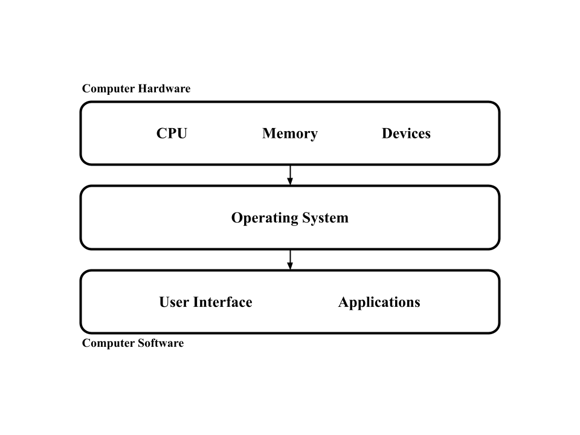

# Setting Up Your Environment

Let's make an operating system in Rust. An *operating system* is the layer of abstraction between a computer's hardware and software.

  

It allows users like you and I to utilize the fullest potential of their computer's hardware without worrying about the inner details of the hardware. This is a very broad definition because the operating system is responsible for a broad range of tasks like memory, processes, networking, concurrency, etc.

Our goal will be to write an operating system in Rust *without any dependencies*! Just Rust and its core library (thus the name BareOS). This probably isn't feasable for industry-level operating systems, but is great to learn as you get to build everything from the bottom up.

## The QEMU Emulator

Testing your operating system on an actual computer is difficult as every time any change is made, you need to burn your project onto a USB stick and reboot your machine. If you develop with only one machine, constantly switching and rebooting between the operating system your making and the operating system you're developing on will really slow down any progress you're making. 

Instead, we are going to use an *emulator*, which simulates the hardware of a regular computer. This allows you to develop and test on one machine without needing constant reboots.

Next, we want to choose which *architecture* we want our operating system to run on. Different computer architectures have different hardware specs and instruction sets which will affect how you design your OS. This tutorial will use the x86 architecture as it's the most documented architecture for OS development.

`QEMU` is definitely the most popular emulator used for OS development. Installing it on macOS is a simple `brew install qemu` on the terminal, and you can find easy ways to install it online if you don't use macOS.

Installing `QEMU` should allow you to use the `qemu-system-x86_64` command, which emulates an x86 machine. Run `qemu-system-x86_64 --version` on your terminal to verify that it's there. This is nice because after we are done with setup, it won't matter which architecture your machine uses as we will all be developing for x86 via the `QEMU` emulator.

## The Goal

Rust code by default generates programs that are run on your personal machine, not on the emulator. The goal of this section is to create a Rust project that compiles a program designed for our emulator's x86 architecture.