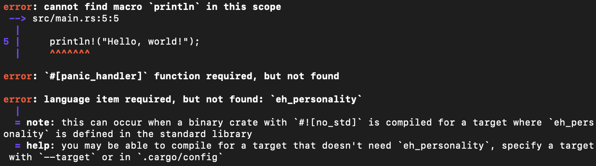
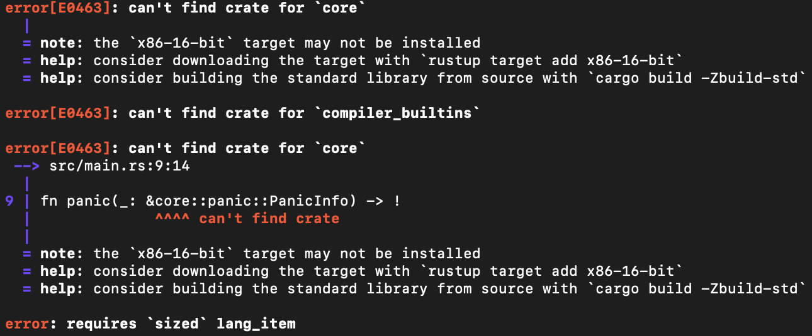
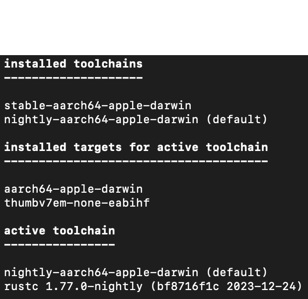
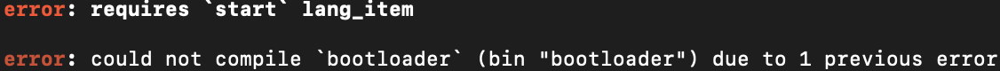
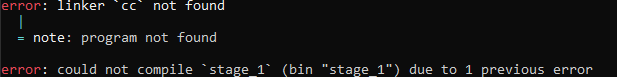

# A Freestanding x86 Rust Binary

Rust code by default generates programs that are run on your personal machine, which may or may not be the right architecture (x86). The goal of this section is to create a Rust project that compiles specifically for the desired x86 architecture, regardless of what your personal machine's architecture is.

> 🚨 **DISCLAIMER:** Even if your machine is x86, Rust will almost certainly *not* produce a binary suitable for an x86 machine when it is first powered on!! These two environments are very different. You'll (unfortunately) still need to do all the setup.

The project will contain a kernel and the first stage bootloader for now. My recommendation is to structure your project something like...

```
bare_os
├── bootloader
│   └── stage_1
│       ├── Cargo.toml
│       └── src
│           └── main.rs
└── kernel
```

...where `kernel` is an empty directory for now. If you're on a UNIX system, creating this structure on the terminal looks something like...

```properties
mkdir bare_os
cd bare_os
mkdir bootloader
mkdir kernel
cd bootloader
cargo new stage_1
```

`cargo new stage_1` will automatically set up the `stage_1` directory for us and populate `main.rs` with a simple `Hello, World!` program. We'll reuse this once we get to stages 2 and 3 for the bootloader. Let's start writing the bootloader.

## Unlinking with the Standard Library

`cargo`'s auto-generated project has a few problems. Firstly, Rust **by default** links with its *standard library* when generating executables. In general, the Rust standard library requires OS-dependent features like a heap, networking, threads, etc. Because we don't have an operating system, we can't link to the Rust standard library. Disabling this is pretty easy, we just need to include the `#![no_std]` attribute to the very top of `main.rs`.

```Rust
#![no_std]

fn main()
{
    println!("Hello, World");
}
```

We can generate the program by executing the terminal command `cargo build` inside the `stage_1` directory. 3 compile-time errors show up in our code.

<p align="center">
  
</p>

> ❓ **Why `cargo build` and not `cargo run`?**
>
> `cargo run` not only compiles the project but also executes it on your personal machine. Remember, this project is intended to compile for an x86 machine on start-up. `cargo build` just compiles the project without executing it.

The first two are pretty easy to solve...

1. It turns out that Rust's `println!` macro requires the standard library, so we can't use it.
2. Whenever Rust encounters unsound code at runtime (like an out-of-bounds error), it invokes its *panic handler*, which is defined by its standard library. Without the standard library, we must write our own *panic handler*, and for now, we will just infinitely loop.

```Rust
#![no_std]

fn main() { }

#[panic_handler]
fn panic(_: &core::panic::PanicInfo) -> !
{
    loop {}
}
```

The third error specifies that the `eh_personality` language item is required. Its error message gives some useful information. It seems like the default target *requires* this `eh_personality` language item, but we can specify a target that doesn't.

> ℹ️ **INFO:** Some compilers might provide a different error message with nothing about `eh_personality`:
> 
> <p align="center">
>   
> </p>
> 
> Regardless, part of this error is about the default "panic strategy" that Rust uses.

## Specifying the x86 Target

By default, Rust compiles for your personal machine's *target triplet*, which describes the *platform* of a machine. A target triple contains its...

1. Computer architecture (talked about in the Introduction),
2. The vendor, or who supplied the machine,
3. And the machine's operating system.
4. We can also optionally supply an *environment field*. We'll actually be needing this.

Each one of these fields are separated by dashes. You can run the terminal command...

```properties
rustc --version --verbose
``` 

...to see what target triplet Rust is currently compiling for on your machine, next to `host:`.

Most likely, it is not the target that we want. Let's construct a target triplet for an x86 machine on start-up. We'll then specify to Rust that we want to compile for this particular target triplet.

> ❗ **IMPORTANT** An x86 machine on start-up begins in *16-bit real mode*. This will be important when figuring out its target triplet.

1. The three most commonly used computer architectures in a target triplet are...

    * `aarch64` covers machines with the `arm` architecture.
    * `i686` covers the 16-bit and 32-bit versions of `x86`.
    * `x86_64` covers the 64-bit version of `x86`.

    Since an x86 machine begins in *16-bit real mode*, its target triplet computer architecture is `i686`.

2. We are the vendors for this platform. Unfortunately, *"we"* are not part of the list of approved target triplet vendors. Thankfully, we can put `unknown` for that field.

3. We don't have an operating system, so we can similarly specify `none` for the field.

4. Recall that a target triplet can *optionally* contain a fourth *environment field* The `i686` architecture covers both 16-bit and 32-bit versions of `x86`, but we can emphasize this platform's 16-bit environment by adding the `code16` environment field.

Overall, the target triplet of an x86 machine on start-up is...

```
i686-unknown-node-code16
```

However, a *target triple* is one component of an overall target and isn't enough in this case. The way you specify a *target* (not just a *target triple*) is through a JSON file. The minimum JSON file for the `i686-unknown-node-code16` target triplet is...

```json
{
    "llvm-target": "i686-unknown-none-code16",
    "arch": "x86",
    "data-layout": "e-m:e-p:32:32-p270:32:32-p271:32:32-p272:64:64-i128:128-f64:32:64-f80:32-n8:16:32-S128",
    "target-pointer-width": "32"
}
```

This JSON further specifies `x86` as the target's architecture. The `data-layout` and `target-pointer-width` tags specify required properties about the architecture like data types (floats, integers, pointers), stack alignment, etc.

This is where we will resolve the third `eh_personality` error. The `eh` stands for "exception handling", and Rust typically inserts a stack unwinding procedure after a panic so that no resources are leaked. This procedure, however, requires OS-specific support which we don't have. 

Instead, we can change Rust's panic strategy to just abort on panic without running any clean-up procedure. We specify this by adding the following line to our JSON file:

```json
"panic-strategy": "abort"
```

Since the panic strategy doesn't require any OS-dependent features anymore, the `eh_personality` error shouldn't be an issue.

Right now, the target file is just a standalone JSON file. Following the `eh_personality` error message feedback, we can tell Rust to compile for the target specified in this JSON file through its `.cargo/config.toml` file, which isn't present yet. Let's add this `.cargo/config.toml` file to the `stage_1` directory...

```
stage_1
├── .cargo
│   └── config.toml
├── Cargo.toml
└── src
    └── main.rs
```

The target JSON file's location (wherever you choose to store it) can be specified within this `config.toml` file, 

```toml
[build]
target = "relative-path/from-stage-1-dir/to-your/x86-16-bit.json"
```

We will need multiple target specifications as we write the bootloader/operating system, so my recommendation is to have a `target_specs` directory just underneath the root `bare_os` directory to store all the target specifications.

Now when I run the project, the `eh_personality` error disappears, but there's a few more issues that come up:

<p align="center">
  
</p>

It seems like Rust can't find the `core` and `compiler-builtins` crates.

## Compiling Core Crates

A Rust project may link without a standard library, but it must *at least* contain the `core` and `compiler_builtins` crates. These crates come precompiled for the most popular target triplets when we first install Rust. However, because we defined our customized target through a JSON file, Rust doesn't contain these crates pre-built for it.

Thankfully, we have the ability to compile these crates on-demand by adding this to the `.cargo/config.toml` file...

```toml
[unstable]
build-std = ["core", "compiler_builtins"]
```

This feature is still relatively new which is why it is marked with an `unstable` tag.

However, Rust's compiler is set to the `stable` channel by default, meaning all functionality this compiler provides is *guaranteed* to be valid *forever* in all future Rust versions. This however means that you cannot use any unstable features.

The `nightly` channel, on the otherhand, allows you to use unstable Rust features. This also means that these may be removed on a "nightly" basis. These specific `unstable` core crates feature has been available and valid since at least 2020, so I think it's safe to use it. Changing our Rust toolchain to "nightly" is very simple. Just run...

```properties
rustup default nightly
```

...on your terminal and you're good to go. To confirm that you really are using the nightly toolchain, you can run...

```properties
rustup show
```

...on your terminal and if you see that the `nightly` toolchain is the `default` one under the `installed toolchains` section, you're good to go. This is how it looks like for me...

<p align="center">
  
</p>

## Overwriting Rust's Entry Point

Now when we compile, there is one more error to fix where we are missing a `start` language item...

<p align="center">
  
</p>

Most programming languages have what's called a *runtime system*, which is a wrapper around the typical `main` function that sets up the stack and inserts arguments into the correct places before `main` begins and cleans up resources used after `main` finished.

Rust has a runtime system but we don't have access to it without the standard library. A `main` function implies the use of Rust's runtime system, so we want to not have a `main` function at all by specifying the `#![no_main]` attribute and removing the old `main` function. The Rust file now looks like...

```Rust
#![no_std]
#![no_main]

#![panic_handler]
fn panic(_: &core::panic::PanicInfo) -> !
{
    loop {}
}
```

There is one last linker error:

<p align="center">
  
</p>

To simplify, Rust's runtime system includes a C runtime system, so Rust projects uses C's `cc` linker by default, which expects a C runtime system. However, because we don't have a Rust runtime system, there of course isn't a C runtime system. Instead, we will use Rust's linker `rust-lld`, which does not require any runtime system, by adding these two key/value pairs to the target specification JSON file:

```json
"linker": "rust-lld",
"linker-flavor": "ld.lld"
```

Finally, Rust successfully compiles the freestanding executable at...

```
bare_os/bootloader/stage_1/target/<name_of_your_json_file>/debug/stage_1
``` 

...without any errors! Granted, we can’t do much with it right now (there isn't even an entry point), but it is a completely valid x86 executable that is entirely OS-independent!

In the next section, we will make our executable useful by making it runnable on an x86 machine.