# Writing a Boot Sector

We have a freestanding Rust binary designed for the x86 architecture, but it's still not quite ready yet for an x86 machine on start-up.

### Creating a Raw Binary File

An x86 machine on start-up expects a *raw binary file* as a bootloader. Let's see the format of our current executable...

> /🐧 **On Mac/Linux:** The `file` command allows us to see the format of any specified file.
>
> ⊞ **On Windows:** The `file` command on Windows is accessible inside the MSYS2 Shell which can be installed through <https://www.msys2.org/>. This shell will be needed for installing future command line tools as well.

<p align="center">
  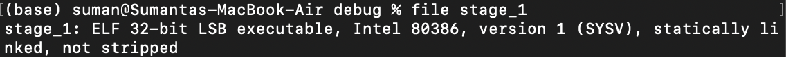
</p>

The Rust compiler generated a file in the *ELF format*, which is essentially a binary file with a bunch of associated metadata. An x86 machine on start-up is *not* expecting any of this metadata when it runs our program, so our task is now to strip it from our generated file.

Thankfully, there is a command line tool called `objcopy` that precisely strips metadata from ELF files.

> 🐧 **On Linux:** `objcopy` is installed on Linux machines by default.
>
>  **On Mac:** Running `brew install x86_64-elf-binutils` allows you to use the `x86_64-elf-objcopy` tool, which is the same as Window's and Linux's `objcopy`.
>
> ⊞ **On Windows:**
> 1. If you haven't already, install the MSYS2 Shell through <https://www.msys2.org/>.
> 2. Running `pacman -S mingw-w64-x86_64-binutils` within the MSYS2 Shell installs `objcopy` on your machine.
>
>    ❗ **IMPORTANT:** `objcopy` will be usable within Window's default Command Prompt, not the MSYS2 shell.
>
> 3. If you still cannot run `objcopy`, make sure that `C:\mysys64\mingw64\bin` (MSYS2 Shell's binaries directory) is part of your system's `Path` environment variable.
>     1. Navigate to your system's environment variables under `Control Panel`.
>     2. Under `System variables`, add `C:\mysys64\mingw64\bin` to the `Path` variable. Restart your shell and `objcopy` should be usable now.
>
> You can verify installation by running `objcopy --version` on Linux and Windows or `x86_64-elf-objcopy` on the Mac.

The `objcopy` command has the following format:

```properties
objcopy -I <input-format> -O <output-format> <input-file> <output-location>
```

Let's go through each of these fields:

* The specific `<input-format>` of the generated file is `elf32-i386`, and we can see this matches with what command-line tools say the format of the file is:

<p align="center">
  
</p>

* We want the `<output-format>` to be a raw `binary` file.
* The `<input-file>` we want to convert is the `stage_1` compiled file.
* I'll call the `<output-location>` as `stage_1.bin`, emphasizing that this file is a *raw binary file*.

The final command to run (within the directory with your compiled `stage_1` file) is:

```properties
objcopy -I elf32-i386 -O binary stage_1 stage_1.bin
```

> 🚨 **REMINDER:** If you are on a Mac , remember to write `x86_64-elf-objcopy` instead of just `objcopy`.

We finally have a file, `stage_1.bin`, in the format that an x86 machine on start-up would like. Let's run it.

### The QEMU Emulator

Testing your bootloader and your operating system on an actual computer is difficult as every time any change is made, you need to burn your project onto a USB stick and reboot your machine. If you develop with only one machine, constantly switching and rebooting between the operating system your making and the operating system you're developing on will really slow down any progress you're making. 

Instead, we are going to use an *emulator*, which emulates the hardware of a regular computer. This allows you to develop and test on one machine without needing constant reboots.

`QEMU` is definitely the most popular emulator used for OS development. You can find installation instructions at <https://www.qemu.org/download/>.

Installing `QEMU` should allow you to use the `qemu-system-x86_64` command, which emulates an x86 machine. Run `qemu-system-x86_64 --version` on your terminal to verify that it's there. This is nice because after we are done with setup, it won't matter which architecture your machine uses as we will all be developing for x86 through the `QEMU`'s x86 emulator.

We can run our generated `stage_1.bin` file on QEMU with the command...

```properties
qemu-system-x86_64 -drive format=raw,file=stage_1.bin
```

After a few seconds, QEMU will complain that there is `No bootable device`.

<p align="center">
  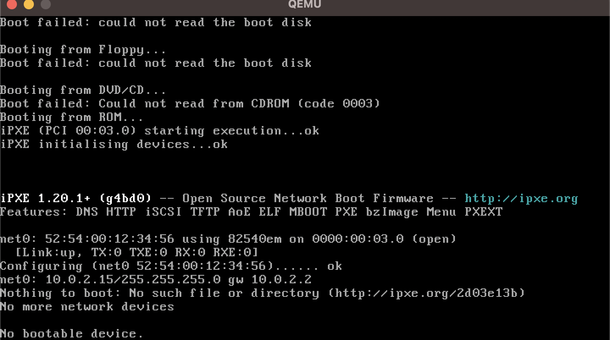
</p>

QEMU isn't recognizing our binary file as valid bootable code. Let's revisit exactly how QEMU and other x86 machines on start-up handle the booting process.

### What Went Wrong? Revisiting the Booting Process

The command tells QEMU to treat our binary file `stage_1.bin` as its emulated *hard disk*, which is a type of secondary storage.

> **A Quick Computer Architecture Tour**
>
> A computer's *central processing unit* (CPU) is the hardware computer that is responsible for running computer instructions.
>
> <p align="center">
>   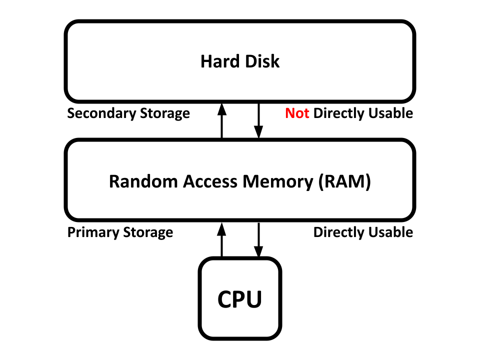
> </p>
>
> However, running instructions isn't useful if you don't have memory to work with. *Random Access Memory* (RAM) is a form of *primary memory storage* that a CPU can directly work with. 
>
> *Secondary memory storages* (like the *hard disk*) are usually significantly larger than primary storage, but cannot directly be used by the CPU. Memory from secondary storage must first be copied over to primary storage before the CPU can work on it.
>
> A computer's primary storage is generally wiped and reset every time a computer is powered on. Memory in secondary storage, on the other hand, persists throughout computer start-ups. This is why bootloaders and kernels are kept in secondary storage, so they don't get wiped and deleted in primary storage on a power off.

Secondary storage devices like the hard disk are split into *sectors*, which are 512 bytes long. If the *first* sector of a hard disk has the magic number `0xaa55` as its last 2 bytes (511<sup>th</sup> and 512<sup>th</sup> bytes), then the entire hard disk is considered bootable.

<p align="center">
  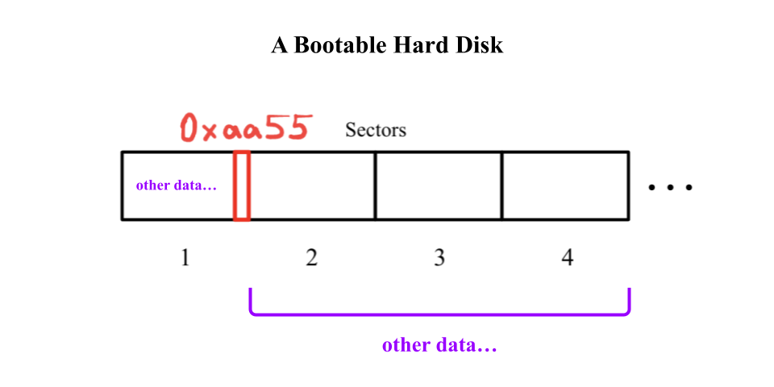
</p>

> ❓ **What is `0xaa55`?**
>
> `0xaa55` is a number where the `0x` prefix declares the rest of the number to be in *base-16*, or in *hexadecimal*, which has 16 digits (`0` - `9` and `a` - `f`) instead of the decimal system's 10 digits. 
>
> Some other common prefixes:
> * `0b` prefixes a number in binary (*base-2*, with only `0` and `1` as its digits)
> * `0o` prefixes a number in octal (*base-8*, with digits `0` - `7`)

1️⃣ **We don't have `0xaa55` as the 511<sup>th</sup> and 512<sup>th</sup> bytes of our program's raw binary file**, which is why it won't boot.

Remember, memory in secondary storage isn't directly usable by the CPU. In order for the CPU to start operating on our bootloader in its hard disk, it copies the first sector in the hard disk and pastes it into RAM (primary storage) *specifically* at memory location `0x7c00`. It will then interpret the start of the first sector at `0x7c00` as computer instructions and start running them on the CPU.

If we want the machine to execute our program, 2️⃣ **we need to put our program at the *start* of the hard disk**. This allows the program to be placed at `0x7c00` in RAM where the CPU will begin executing it.

### Creating a Linker Script

To recap, we have 2 things to fix:

1. Place `0xaa55` at the end of our program raw binary's first sector.
2. Place the program instructions themselves at the *start* of the raw binary.

Unfortunately, this cannot be done directly within Rust code. We are going to need the help of a *linker script*, which acts as a recipe that Rust's linker follows to generate the raw binary file.

Rust auto-generates a linker script by default, but we can override it by adding `build.rs` within the `stage_1` directory. The `build.rs` file is a *build script*, which allows you to set configuration properties before the project is compiled.

```Rust
// build.rs

fn main()
{
    println!("cargo:rustc-link-arg-bins=--script=linker.ld");
}
```

This build script tells us to use `linker.ld` as the linker script (rather than the generated default one). This file doesn't exist just yet, so let's add it:

```
stage_1
├── .cargo
│   └── config.toml
├── Cargo.toml
├── build.rs
├── linker.ld
└── src
    └── main.rs
```

`build.rs` and `linker.ld` are the newly added files.

The linker script has two components:

1. One defining the *entry point* of the program.
2. The other defining the *sections* of your program.

The skeleton of a linker scipt looks like this:

```Linker Script
ENTRY(1️⃣)

SECTIONS
{
    2️⃣
}
```

1️⃣ is where we will be declaring our entry point, and 2️⃣ is where we define the ordering of our sections.

### Creating an Entry Point

Let's start by adding an entry point to our Rust program. We'll just have it infinitely looping for now:

```Rust
#![no_std]
#![no_main]

#[no_mangle]
fn entry() -> !
{
    loop {}
}

#[panic_handler]
fn panic(_: &core::panic::PanicInfo) -> !
{
    loop {}
}
```

...and now we update the linker script:

```Linker Script
ENTRY(entry)

SECTIONS
{
    
}
```

> ❓ **What is `#[no_mangle]` and why is it needed?**
>
> Rust allows multiple functions to have the same name, as long as they are in *different scopes*. For example, the following code is valid:
>
> ```Rust
> struct A;
> struct B;
>
> impl A { fn foo() { ... } }
> impl B { fn foo() { ... } }
> ```
>
> Notice how there are two functions both named `foo`, but in different scopes.
>
> However, functions *cannot* have duplicate names by the time they are sent to Rust's linker. So, the compiler "mangles" these function names into some encoded (but unique) mess to be sent to the linker. For example, `A::foo()` will be mangled into something like...
>
> ```
> _ZN7example3A3foo17h16fcc82fa6043ccbE
> ```
>
> If the `entry` function doesn't have the `#[no_mangle]` attribute, then the label we declared in the linker script (`entry`) won't match up with the mangled label in Rust, and the linker wouldn't be able to find the function our linker script refers to.
>
> So, we tell the the compiler to leave the `entry` function unmangled with the `#[no_mangle]` attribute so that the linker script and the linker are on the same page.

### Placing the Entry Point

We now have an `entry` point, but program entry points are not necessarily placed in the beginning of the produced binary. For example, Rust and C have no specification in the ordering of function placements, meaning their `main` entry point can be placed who knows where?

This is where the `SECTIONS` part of the linker script, which is where we get to define the ordering of the different *sections* of the program.

Rust's compiler and assembler breaks down our Rust source code into different *sections* in our ELF file. The 4 most commonly generated sections are...

* The `.text` section, which contains the instructions of our program. Remember that code itself is memory, and this is where they are stored.
* The `.data` section keeps track of a program's global data and static variables.
* The `.rodata` section keeps track of read only data like global constants.
* The `.bss` section keeps track of *uninitialized* global data.

We can see all the sections that Rust generated for our program by using the `readelf` tool on Linux/Windows or `x86_64-elf-readelf` on macOS (which should have been installed with `x86_64-elf-objcopy`). First, compile the project with `cargo build`. Then run...

* 🐧/⊞ **On Linux/Windows:** `readelf -l stage_1`
*  **On Mac:** `x86_64-elf-readelf -l stage_1`

...where `stage_1` is the compiled ELF file by Rust, and we can see Rust generates 1 section for the program: `.text.entry`:

<p align="center">
  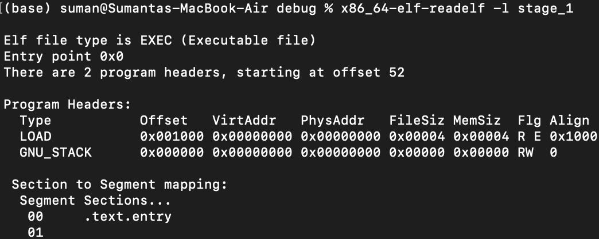
</p>

`.text.entry` is a subsection of its `.text` section. More specifically, it will contain the instructions of the `entry` function in our Rust source code. We can place this section at the very start of the produced raw binary by updating the linker script:

```Linker Script linenums
ENTRY(entry)

SECTIONS
{
    .text : 
    {
        *(.text.entry)
        *(.text .text.*)
    }
}
```

Let's analyze this:

* `.text :` names a new *section*. We can name it whatever we want, but I decided to stay consistent and name it `.text`.
* `*(.text.entry)` is where I specifically tell the linker to place our `.text.entry` section first. This line makes `.text.entry` a "sub-section" of our newly created `.text` section.
* `*(.text .text.*)` is where I place any other Rust-generated `.text` subsections. These don't exist right now, but I'm future-proofing the linker script for when we do add more code.

<p align="center">
  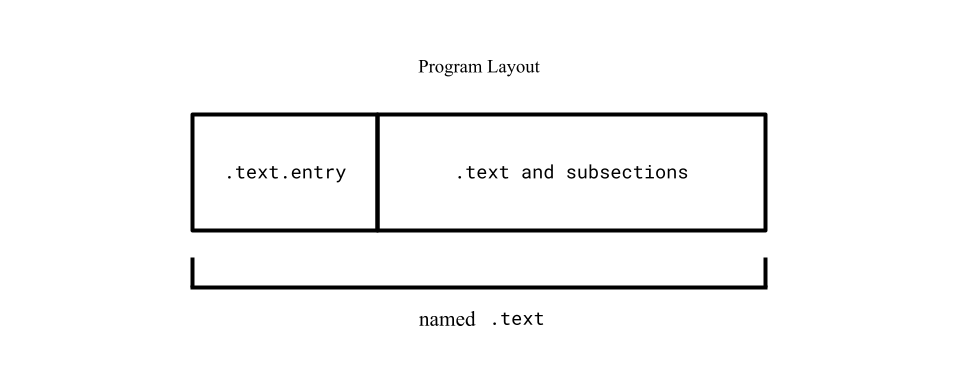
</p>

> ⚠️ **NOTE:** If you recompile and run the `readelf` tool at this point, you'll notice the `.text.entry` section doesn't show up anymore. The `readelf` tool only shows *top-level* sections. `.text.entry` won't show up anymore since it's now a subsection of the newly created `.text`.

Because there isn't any global data, we don't have to worry about the `.data`, `.rodata`, or `.bss` sections.

We've effectively put our entry code at the start of our program, but there's still a problem.

### Correcting Program Offsets

Remember, our bootloader will be placed at memory address `0x7c00`. However, the linker by default believes the program starts at `0x0`. We can verify this with the previous `readelf` tool output:

<p align="center">
  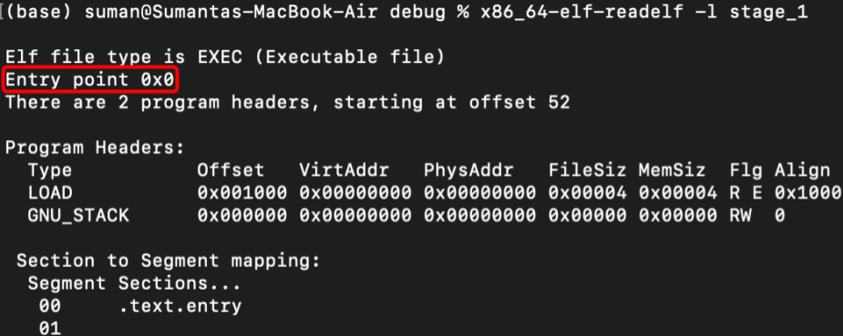
</p>

Therefore, it will set any function labels and global data to also be offset from `0x0` and if we ever call these functions or access global data from the bootloader, it will go to some uncharted region in memory near `0x0` when it's really near `0x7c00`. 

Instead, we need to code the right offset into our linker script so that the linker is aligned with where QEMU will actually place our program. Solving this isn't too bad...

The linker script's *location counter* (referred to by just the `.` character) stores what the current output location is. It can be thought of as a pointer to the current memory location during program generation.

By setting this location counter to `0x7c00` just before the linker generates our named `.text` link section, it will treat everything within the section as if it is placed directly after `0x7c00`. Doing this is simple: just add the following line to the linker script...

```Linker Script
ENTRY(entry)

SECTIONS
{
    . = 0x7c00;
    .text : 
    {
        *(.text.entry)
        *(.text .text.*)
    }
}
```

...and we're good to go. We tell the linker to generate the `.text` link section as if it starts at `0x7c00`, so all our function labels and data are placed at the right offset. We can confirm this by rebuilding our project with `cargo build` and running the `readelf` command again:

<p align="center">
  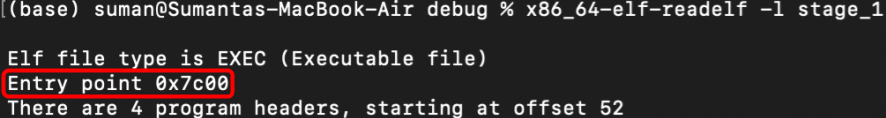
</p>

### Placing the Boot Magic Number

Linker scripts also allows adding specific bytes in specific places. We can include the magic number `0xaa55` by adding the following link section to the script:

```Linker Script
ENTRY(entry)

SECTIONS
{
    . = 0x7c00;
    .text : 
    {
        *(.text.entry)
        *(.text .text.*)
    }

    . = 0x7c00 + 510;
    .magic_number :
    {
        SHORT(0xaa55)
    }
}
```

Let's go through the final linker script:

* `. = 0x7c00;` tells the linker to treat the current "output location" to `0x7c00` before creating any link sections.
* `.text : { ... }` tells the linker to create the `.text` link section and because it is placed directly after `0x7c00`, all generated offsets will point to the right location in the machine's RAM.
* `. = 0x7c00 + 510` places the new location counter to `0x7c00 + 510`, leaving enough empty space in the middle.
* `.magic_number : { ... }` is where the linker adds the `.magic_number` link section and populates it with the `0xaa55` magic number. The linker script uses `BYTE` to declare 1 byte, `SHORT` for 2, `QUAD` for 4, etc. Since we set to location counter to `0x7c00 + 510` before this link section, these 2 magic-number bytes will be placed in the last 2 bytes of the generated raw binary's first sector.

<p align="center">
  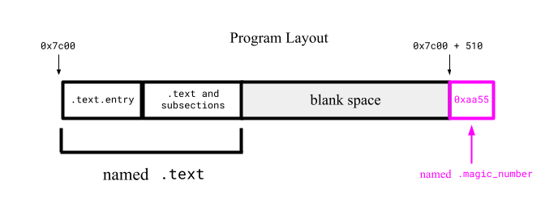
</p>

When we rebuild the Rust project and convert the compiled ELF file to a raw binary with `objcopy` (just as before in this section), we should have a valid runnable x86 bootloader binary file that 1️⃣ places the entry point at the start of the file, and 2️⃣ places the magic number `0xaa55` at the end of the raw binary's first sector.

You can confirm these properties if you have a built-in byte-by-byte file analyzer in your code editor (VSCode should have one). If not, you can see the byte-by-byte contents through the terminal:

> /🐧 **On Mac/Linux:** `xxd stage_1.bin`
>
> ⊞ **On Windows:** `Format-Hex stage_1.bin` on Window's PowerShell (not Command Prompt).

<p align="center">
  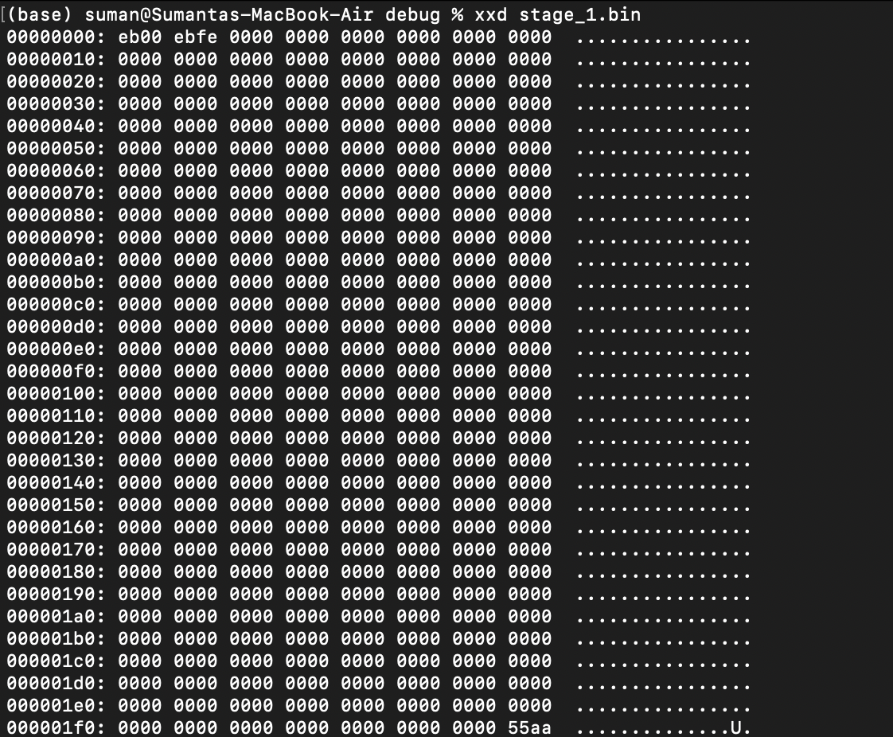
</p>

We can see the magic number `0xaa55` (could be reversed due to *machine endianness*, or whether your machine outputs the most-significant or least-significant byte first) placed as the last 2 bytes of the binary's first sector. 

We also see some bytes placed in at the start of the file: these bytes are instructions from the `entry` function from Rust that we specifically told the linker to place at the start (through the `.text.entry` section). Everything looks good, let's convert the compiled ELF file into a raw binary...

```properties
objcopy -I elf32-i386 -O binary stage_1 stage_1.bin
```

...and run it on QEMU:

```properties
qemu-system-x86_64 -drive format=raw,file=stage_1.bin
```

<p align="center">
  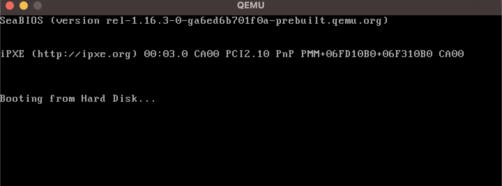
</p>

The emulator detected our hard disk to be a bootable device and hangs due to the infinite loop within Rust's `entry` function. Perfect!

We finally have a runnable stage 1 bootloader on x86 emulators and machines. In the next section, we'll actually begin development in Rust so that our bootloader does more than just infinitely hang.