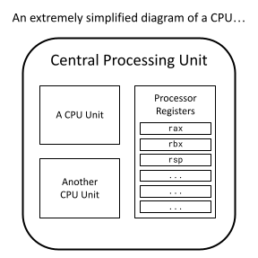
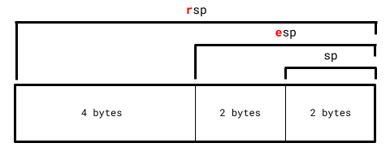
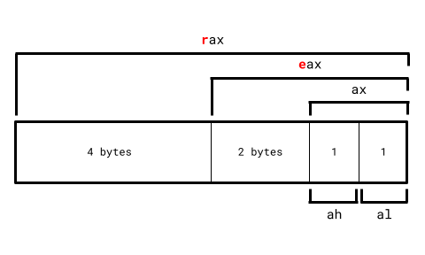
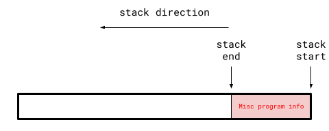
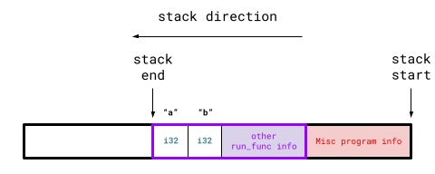
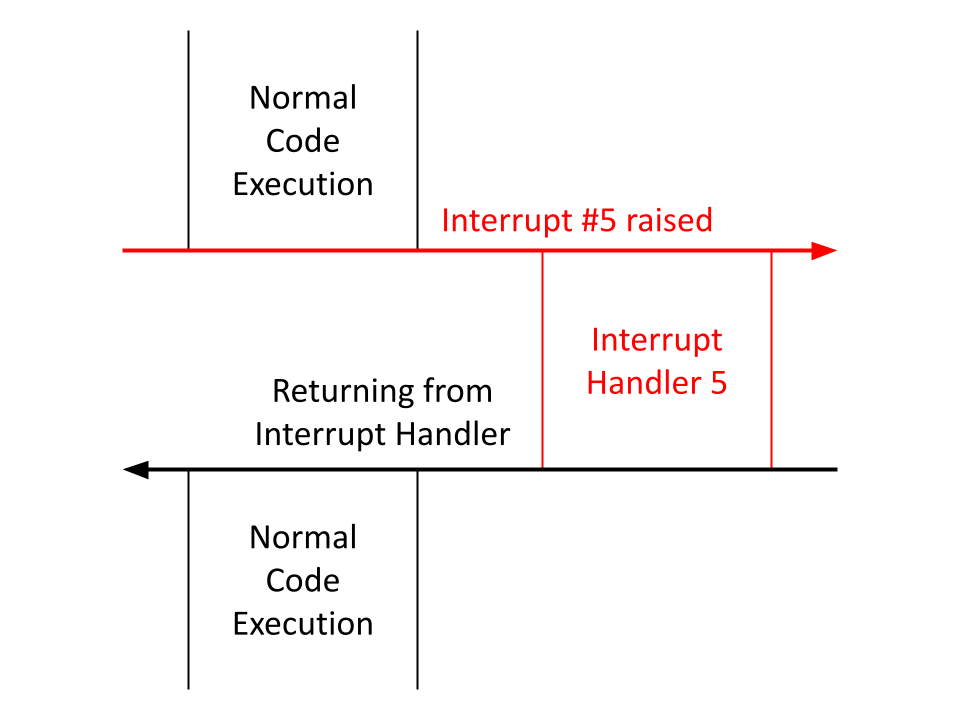
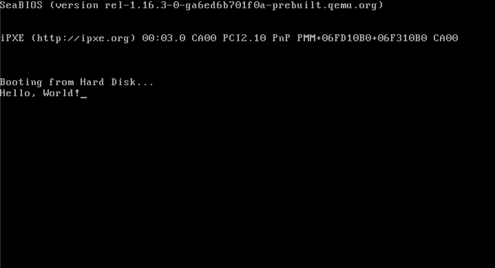

# Exploring the Machine's Environment

One thing before we start, running the commands to generate and run our raw binary over and over again is a bit tedious, so my recommendation is to find some way to automate it. A shell script at the top-level directory `scratch_os/` would look like...

```properties
cd bootloader/stage_1/
cargo build --release
cd target/<name_of_your_json_file>/release/
objcopy -I elf32-i386 -O binary stage_1 stage_1.bin
qemu-system-x86_64 -drive format=raw,file=stage_1.bin
```

>  Macs would use `x86_64-elf-objcopy` instead of `objcopy`.

> 🔔 **REMINDER:** `<name_of_your_json_file>` is whatever you named your x86 16-bit target specification JSON file (created in [Section 1.1](https://sumandas27.github.io/scratchOS-Blog/ch01-01-a-freestanding-x86-rust-binary.html)) as this is what Rust uses to generate the directory it stores its compiled artifacts in.

> ❓ **1. What is the `--release` option in `cargo build`?**
>
> When Rust compiles a project through `cargo build` or `cargo run`, it compiles without optimizations by default to allow for the best debugging information for bugfixing and troubleshooting. This is problematic in our case as it would take very little code to exceed our 512-byte boot sector memory limit without optimizations.
>
> Adding the `--release` option tells Rust to maximize optimizations and minimize binary size when compiling the project. This option is what brings the final stage 1 bootloader to under 512 bytes.
>
> ❓ **2. Why are all my artifacts now in `release/` instead of `debug/`?**
>
> Compiling your Rust project with `--release` places its artifacts in `release/` instead of the default `debug/` directory.

You could write a `Makefile` for this on Unix-based systems, although they aren't trivial to learn/write. 

I keep my automated binary generation code in Rust, and make the top-level directory `scratch_os/` into its own `cargo` project. That way, all I have to do is run `cargo run` from the top-level directory `scratch_os/`, and the final raw binary is generated and executed on QEMU. <u>This is the primary method I'll be using in this blog!</u>

> ℹ️ My source code reference for the above Rust project structure can be found under `scratch_os-blog-src/ch01-03-src` within this blog's [GitHub Repository](https://github.com/sumandas27/scratchOS-Blog).

The start of our bootloader code is going to pretty involved and will require a lot of inline assembly, so I don't think it's smart to jump straight into the code. Instead, I'll spend a lot of this section exploring the hardware environment we are in to motivate what our bootloader code aims to do. 

This section is a bit long, so I'll briefly list what I plan on covering:

1. Processor registers in 16-bit real mode.
2. The program stack and setting the stack pointer in assembly.
3. Memory segmentation and zeroing out segment registers in assembly.
4. Translating our small assembly work to Rust.
5. The machine's BIOS software and using its utility to write a `Hello, World!` from our Rust bootloader.

Let's begin:

### Processor Registers

Just like how secondary storage and RAM are types of computer memory, *processor registers* are another type of memory. They are tiny pieces of storage that lives directly on the CPU. Because they are so close to the CPU, operating with a processor register is *by far* the fastest out of any memory type. However, registers are *extremely small*, 8 bytes wide on the x86 architecture, and there aren't many of them to use. In fact, each processor register has its own 2 to 3 letter name like `rax`, `rbx`, `rsp`, etc.

<p align="center">
  
</p>

I mentioned in [Section 1.1](https://sumandas27.github.io/scratchOS-Blog/ch01-01-a-freestanding-x86-rust-binary.html) that x86 machines start in *16-bit real mode* (while writing the custom target JSON file). This means that in this 16-bit state, we can only use a quarter of every register. 

> A typical register is 8 bytes long, so a quarter of it is 2 bytes or 16 bits, hence the name *16-bit real mode*.

<p align="center">
  
</p>

An x86 machine is always in one of three modes:

* 16-bit real mode (the currently active one) where registers don't have any letter prefix.
* 32-bit protected mode where registers are prefixed with the letter `e`.
* 64-bit long mode where registers are prefixed with the letter `r`.

> ℹ️ **EXAMPLE:** Taking the register `rsp` as an example, we can only refer to it with its first 2 bytes as `sp` for now since we're in 16-bit long mode. We won't be able to use `rsp` and its full 8 bytes until we move to 64-bit long mode.

Additionally, there are 4 important general-purpose registers on the CPU: `rax`, `rbx`, `rcx`, and `rdx`. In 16-bit mode specifically, these 4 registers can be split up even further. 

Take `rax` as an example: Its 16-bit register `ax` can further be split into `ah` and `al`, where:

* `ah` the high register (`h`) is the higher byte of `ax`.
* `al` the low register (`l`) is the lower byte of `ax`.

<p align="center">
  
</p>

In total:

* `ah`, `bh`, `ch`, and `dh` are the 4 high registers in 16-bit real mode.
* `al`, `bl`, `cl`, and `dl` are the 4 low registers in 16-bit real mode.

### The Program Stack

A computer program cannot operate without a valid program stack. A *program stack* is an area of memory in RAM that a program uses to store its local variables and function call information.

Consider this sample Rust program:

```Rust
fn main()
{
    let res = run_func();
    ...
}

fn run_func() -> i32
{
    let mut a: i32 = 4;
    let mut b: i32 = 10;

    a = a * b;
    b = a * b;
    return a + b;
}
```

As a machine runs through the program, before it enters `run_func`, the stack (vastly oversimplified) looks something like:

<p align="center">
  
</p>

Notice how the stack end appears before the stack start. Program stacks always grow *downwards* on x86 machines (and in most other architectures).

As the program enters `run_func`, the program stack adjusts to something like:

<p align="center">
  
</p>

The <span style="color:purple">purple box</span> is the stack addition caused by `run_func`. This addition is called a *stack frame* and each stack frame corresponds to a function call. If there were another function within `run_func`, another stack frame would be "pushed" onto the program stack when entering that function call.

More specifically, the program stack is all stack frames representing all active function calls during program execution.

Analyzing `run_func`'s stack frame, we can see it contains space for all its local variables (`a` and `b` in this case). Stack frame also contain other information like function parameters and which address to go to once this function is exited.

Once the program returns from `run_func`, the program stack reverts to: 

<p align="center">
  
</p>

At this point `run_func`'s information isn't needed anymore, so its stack frame gets "popped" from the program stack.

This program stack mechanism is how a program keeps track of all active function calls, local variables, and parameters as it's being executed.

### Setting the Stack Pointer

A program's stack is so important that it has its own processor register for it, `rsp` ("sp" standing for "stack pointer"). It is responsible in storing the *stack end* of the currently executing process. 

This is relevant to us because an x86 machine on start-up *does not* set the stack pointer, it's the bootloader's responsibility to first set up its own stack *before it does anything else*. Virtually all Rust code utilizes the stack pointer, and running Rust code before setting up the stack pointer will cause major problems.

So we need to find some space in RAM that can act as our bootloader's stack. However, we can't just choose a memory space at random as some spots are reserved by the machine's hardware. Our bootloader's code also takes up some space, so we need to make sure our placed stack doesn't interfere/overwrite any of our bootloader code or machine hardware memory.

Let's look at what the first mebibyte (2<sup>20</sup> bytes) of RAM looks like:

<table>
    <thead>
        <tr>
            <th style="text-align: center">Start (Exclusive)</th>
            <th style="text-align: center">End (Inclusive)</th>
            <th style="text-align: center">Contents</th>
            <th style="text-align: center">Is Usable?</th>
        </tr>
    </thead>
    <tbody>
        <tr>
            <td style="text-align: center"><code>0x0</code></td>
            <td style="text-align: center"><code>0x500</code></td>
            <td style="text-align: center">BIOS Data</td>
            <td style="text-align: center">No</td>
        </tr>
        <tr>
            <td style="text-align: center"><code>0x500</code></td>
            <td style="text-align: center"><code>0x7c00</code></td>
            <td style="text-align: center">Bootloader Memory</td>
            <td style="text-align: center" rowspan="3">Yes</td>
        </tr>
        <tr>
            <td style="text-align: center"><code>0x7c00</code></td>
            <td style="text-align: center"><code>0x7e00</code></td>
            <td style="text-align: center">Bootloader's First Sector</td>
        </tr>
        <tr>
            <td style="text-align: center"><code>0x7e00</code></td>
            <td style="text-align: center"><code>0x80000</code></td>
            <td style="text-align: center">Bootloader Memory</td>
        </tr>
        <tr>
            <td style="text-align: center"><code>0x80000</code></td>
            <td style="text-align: center"><code>0x100000</code></td>
            <td style="text-align: center">Hardware Reserved</td>
            <td style="text-align: center">No</td>
        </tr>
    </tbody>
</table>

It would be smart to leave the space after `0x7e00` for the rest of our bootloader as it gets larger. This leaves us with the usable area from `0x500` to `0x7c00` to act as our bootloader's stack. This area is a bit more than 30,000 bytes large, which will be more than enough for our bootloader's stack.

Setting up the bootloader's stack is nothing more than just setting the stack pointer register `sp` (16-bit register of `rsp`) at the start of the bootloader code. Rust's compiler will then do all the work of adjusting the stack pointer as stack frames get added/removed through function calls.

Since the program stack grows downwards, we want to set the stack pointer to the highest memory address of the stack area, `0x7c00` in this case.

Setting the value of registers requires *assembly language*, which is a programming language low-level enough to be able to interact with registers and its  values. The command we're interested in is `mov`, which has the following syntax:

```nasm
mov [dst], [src]
```

...where the register at `[dst]` is set to the value at `[src]`.

* The `[src]` argument could optionally be another register, in which case the contents of the `[src]` register gets copied into the register at `[dst]`.
* The `[dst]` argument *must* be a register.

If we want to set the stack pointer `sp` to `0x7c00`, this in assembly is:

```assembly
mov sp, 0x7c00
```

> ℹ️ **NOTE:** Everything will still be written 100% in Rust. You can write inline assembly in Rust which will be discussed later.

### Memory Segmentation in 16-Bit Mode

There are two main types of RAM memory addressing schemes that machines use, *paging* and *segmentation*. We'll eventually use paging once we are in 64-bit long mode, but it's important to talk about *memory segmentation* since this is what's used when the machine first boots.

Memory segmentation in 16-bit real mode partitions the entirety of the machine’s RAM into 16-*byte* (not -bit) segments.

When memory segmentation is used, referring to a particular memory address in RAM requires two pieces of information...

1. Which segment is being referred to. If RAM was an array of segments, which index are you selecting?
2. The offset from the selected segment.

The syntax for this memory addressing scheme is `[segment]:[offset]`. For example, `0x100:0x1000` refers to `0x1000` bytes offsetted from the start of the `0x100`<sup>th</sup> segment (offsets can relocate to other segments).

In general:

\\[a = 16s + o\\]

...where \\(a\\) is the *absolute memory address*, \\(s\\) is the *segment* and \\(o\\) is the *offset*.

> Since we're in 16-bit mode, we can only use 16 bits to refer to any segment and offset. Hence, the maximum memory address we can refer to is `65535:65535` (65,535 being the highest representable number with 16 bits), or around 1.06 MB. 
>
> In other words, 16-bit mode has 1.06 MB of total addressable RAM space. This is *extremely low* for a legitimate operating system.
>
> 64-bit long mode on the other hand can address tens of terabytes of RAM space. This is arguably the biggest reason of wanting to make the switch to 64-bit long mode.

However, you can't use any register to refer to a segment. *Segment registers* are a class of registers whose sole purpose is to refer to segments for memory access. The registers `ds`, `es`, `fs`, `gs`, and `ss` make up this class.

### Zeroing the Segment Registers

There are *very* few guarantees that can be made about your environment at startup. One of which is the value of these segment registers, which could be random at boot time. This means if left untouched, using a segment register may point to a random segment and therefore a random memory address, not good. This is why it is common practice to set all segment registers to zero prior before anything else.

However, we can't do something like:

```assembly
; WON'T WORK (the semicolon is assembly's comment delimiter)
mov ds, 0
```

One annoying thing about segment registers is that they can't be set directly. They must be set indirectly through another register. Recall how in the `mov` command, we can set `[src]` to a value `or` a register. For segment registers, the source `must` be register. I'll use the general purpose register `ax` for this:

```assembly
mov ax, 0
mov ds, ax
mov es, ax
mov fs, ax
mov gs, ax
mov ss, ax
```

### Assembly in Rust

To recap, we want to:

1. Set the stack pointer to `0x7c00`.
2. Zero out all segment registers.

I mentioned that this entire project would be in Rust, that was not a lie. Rust has the capabilities of writing inline assembly using its \Verb|core::arch::asm| macro.

```Rust
/* ❗ IMPORTANT:
 * -------------------------------------------------------------
 * This WON'T work right now! A few adjustments need to be made.
 */

#[no_mangle]
fn entry() -> !
{
    unsafe { core::arch::asm!
    (
        "mov sp, 0x7c00",

        "mov ax, 0",
        "mov ds, ax",
        "mov es, ax",
        "mov fs, ax",
        "mov gs, ax",
        "mov ss, ax"
    )}

    loop {}
}
```

> ❓ **What is `unsafe` around the inline assembly?**
>
> All inline assembly within Rust needs to be put around an `unsafe` block. There's a lot of ways to mess up with assembly and bypass required invariants by the Rust compiler, so the `unsafe` block acknowledges that we as programmers are responsible for making sure nothing within the block causes undefined behavior.

As mentioned in the code block's comment, this won't work for a very subtle reason. Recall that every function call get their own stack frame. The `entry` function's stack frame is created before anything in `entry`'s body is run. Rust's compiler can change the stack pointer and segment registers (and any other register) during this stack frame's creation. 

However, we manually change the stack pointer and segment registers within the `entry` function, invalidating the compiler's assumptions about these register states, hence causing undefined behavior.

> ℹ️ Check out this StackOverflow that goes over this exact issue more in-depth: <https://stackoverflow.com/questions/78709286/how-to-prepare-stack-pointer-for-bare-metal-rust/>

Quoting one of the StackOverflow post solutions: "The way to do this would be to make `entry` a naked function (with the `#[naked]` annotation), for which the compiler will not generate any additional assembly code beyond exactly what you specify."

This includes compiler code generation for function stack frames. The downside is that you can *only* write inline assembly with naked functions since fundamental Rust essentials like local variables and returning from functions aren't possible without a stack frame.

```Rust
// entire `main.rs` file

#![no_std]
#![no_main]
#![feature(naked_functions)]

#[naked]
#[no_mangle]
extern "C" fn entry() -> !
{
    unsafe { core::arch::asm!
    (
        "mov sp, 0x7c00",

        "mov ax, 0",
        "mov ds, ax",
        "mov es, ax",
        "mov fs, ax",
        "mov gs, ax",
        "mov ss, ax",

        "hlt",

        options(noreturn)
    )}
}

#[panic_handler]
fn panic(_: &core::panic::PanicInfo) -> !
{
    loop {}
}
```

4 additions have been made:

* Naked functions in Rust are still an unstable feature, which is why we explicitly write `#![feature(naked_functions)]` to use it.

* The `#[naked]` attribute makes `entry` a naked function. Rust functions are currently unsupported for naked functions, so `extern "C"` specifies to use the C's language ABI instead, which is supported in naked functions.

* The `hlt` instruction stops the CPU from executing any further instruction until an interrupt is encountered. Interrupts are disabled at boot-time, so this is essentially an infinite loop.

* Inline assembly blocks allow you to specify options to modify the assembly block's properties. The `noreturn` option is *required* in naked functions. Returning from functions requires information from a stack frame, which naked functions can't generate.

Although we could theoretically write our entire bootloader with inline assembly, it misses the essense of a "Rust" project. We should only use naked functions and `unsafe` blocks in general only when absolutely necessary, so let's find a way to write the rest of our code in Rust after our naked inline assembly setup.

Say we have a Rust function `stage_1_main`, we can't simply make a call like:

```Rust
#[naked]
#[no_mangle]
extern "C" fn entry() -> !
{
    unsafe { core::arch::asm!
    (
        "...", // assembly routine
        options(noreturn)
    )}

    stage_1_main()
}

fn stage_1_main() -> !
{
    loop {}
}
```

...since only inline assembly code is allowed inside naked functions. Thankfully, assembly has the `call` command to invoke a function:

```nasm
call [fn]
```

...where `[fn]` is the function label. However, the inline assembly might not be able to find the function symbol if the compiler *mangles* it. Thankfully, Rust's inline assembly allows us to circumvent this:

```Rust
#[naked]
#[no_mangle]
extern "C" fn entry() -> !
{
    unsafe { core::arch::asm!
    (
        "mov sp, 0x7c00",

        "mov ax, 0",
        "mov ds, ax",
        "mov es, ax",
        "mov fs, ax",
        "mov gs, ax",
        "mov ss, ax",

        "call {main}",

        main = sym stage_1_main,
        options(noreturn)
    )}
}

fn stage_1_main() -> !
{
    loop {}
}
```

Tokens within inline assembly strings enclosed within curly braces introduces a new *template string* (`main` in this case). These templates must refer to either a register, variable, or a <u>function</u>. In this case we use the `sym` keyword to have the `main` template refer to the `stage_1_main` function with its mangled or unmangled symbol name (handled by the compiler 😄). 

Now, `call {main}` effectively invokes `stage_1_main` as intended, and we can write all the Rust code we want within `stage_1_main`!

### The Basic Input Output System

The *Basic Input Output System*, or *BIOS*, is a piece of software that provides a *lot* of utility for us to nagivate the machine's unweildy and OS-free environment.

Our bootloader is *not* the first program that is run on boot-time. This actually belongs to the BIOS. Once the BIOS is initialized, it is actually the piece of software responsible for reading the first sector of a bootable storage device and loading its first sector specifically at `0x7c00`.

Along with loading the boot sector, it provides lots of utility through the use of interrupts. *Interrupts* can be raised manually as a code instruction or through some external event like a keyboard click, and they temporarily pause code execution to run the *interrupt handler* corresponding to the raised interrupt. 

<p align="center">
  
</p>

Raising an interrupt manually as a code instruction is simple. Say I wanted to raise interrupt 99, the assembly code would look like:

```nasm
int 99
```

BIOS sets up a few interrupt handlers in 16-bit mode. The one we want to use for building a `Hello, World!` is BIOS's 16<sup>th</sup> interrupt handler, which can print *one* character to the screen. So to invoke this handler we raise interrupt 16. However, we haven't specified which character we want to print.

The BIOS software expects us to provide interrupt-specific information/parameters in specific registers before that interrupt is raised.

Printing a character with BIOS's 16<sup>th</sup> interrupt handler requires the following register parameters.

| Register | Expected Value                                     |
| :------: | -------------------------------------------------- |
| `ah`     | The Subservice ID                                  |
| `al`     | The ASCII Representation of the Character to Print |

BIOS's interrupt 16 actually provides many services relating to hardware display and graphics. Subservice **14** is specifically responsible for printing a single character to the screen.

> ℹ️ **NOTE:** The *ASCII Table* is a specification that maps common characters to numbers 0-255. The official mapping can be found at <https://www.ascii-code.com>.

As an example, say we want to print the character `a` whose ASCII mapping is 97, the assembly would look like:

```nasm
mov ah, 14      ; print character subservice
mov al, 97      ; `a` ascii value
int 16          ; invoke BIOS handler after register parameters are set
```

### A Bootloader `Hello, World!`

When interpreting this BIOS assembly routine to Rust, we need to be careful about preserving register states. Our routine manually changes `ah` and `al`, and it's very possible that the Rust compiler will misuse these registers outside this BIOS routine due to not accounting for our changes made on these registers.

```Rust
unsafe { core::arch::asm!
(
    "...", // assembly routine
    out("ah") _,
    out("al") _
)}
```

These `out` commands mark `ah` and `al` as *clobbered*, telling the compiler to *revert* `ah` and `al` to their previous values that the compiler is aware of.

> ℹ️ **CLARIFICATION:** 
>
> Changes made to the stack pointer `sp` and segment registers are meant to *persist* beyond its function scope. Marking them as clobbered would revert all these registers to undefined values.
>
> However, the `ah` and `al` registers within the BIOS routine were *only* meant as intermediate "interrupt parameters", and we *don't* want to persist these changes outside the routine, which is why we clobber them.
>
> Technically, `ax` within the naked function was used as an intermediate to zero all segment registers. A few remarks:
>
> 1. Since naked functions don't generate assembly beyond exactly what we specify, the compiler won't make any assumptions on register values that we need to maintain.
>
>       In other words, preserving register values is only necessary in non-naked functions, where compiler-inserted function prologue/epilogue instructions require register assumptions to be consistent across the function's body.
>
> 2. Remember, the `out` command reverts register values *after* the assembly block is executed. But since we marked the naked `entry` assembly routine with `options(noreturn)`, this assembly routine won't ever terminate (it calls `stage_1_main`, which itself never returns) and attempting to add *any* `out` commands to `entry`'s assembly block will actually fail at compile time.
>
>       This means we wouldn't be able to clobber `sp`, the segment registers, and `ax` anyways even if we wanted to.

Opposite to the `out` command, Rust's inline assembly `in` command sets a particular register's value *before* the assembly block is executed. 

With this, we can write our BIOS assembly routine in Rust:

```Rust
unsafe { core::arch::asm!
(
    "int 16",
    in("ah") 14u8,
    in("al") 97u8,
    out("ah") _,
    out("al") _
)}
```

A few notes:

* We set the `ah` and `al` "interrupt parameter" registers before invoking `int 16` through Rust's `in` command. These register states are then preserved with the `out` command.
* Normally, integer literals like `14` and `97` are of type `i32` (32-bit wide integers) by default, but these aren't compatible with the 8-bit wide `ah` and `al` registers, which would fail at compile time.

    The `u8` type represents an 8-bit wide *unsigned* integer (or non-negative integers). This fits better in our case since BIOS subservice IDs and ASCII values will *never* be negative. Register values in general are always set to nonnegative integer values.
    
    We specify `u8` representations of 14 and 97 rather than the `i32` default by writing `14u8` and `97u8`.

If you use the `in` and `out` command on the same register, you can combine them with the `inout` command. The above assembly routine can be simplified to:

```Rust
unsafe { core::arch::asm!
(
    "int 16",
    inout("ah") 14u8 => _,
    inout("al") 97u8 => _
)}
```

This assembly routine will properly print the lowercase character `a` while preserving all register states! Let's generalize this into a utility function to print any character:

```Rust
fn btl_print_char(char_to_print: u8)
{
    unsafe { core::arch::asm!
    (
        "int 16",
        inout("ah") 14u8 => _,
        inout("al") char_to_print => _
    )}
}
```

This is ideal since all possible `u8` values range from 0-255, all of which has a mapping to some character in ASCII. In other words, it's not possible to input a `u8` that goes out-of-bounds from the ASCII table.

We can use this to write a generic print function using BIOS:

```Rust
fn btl_print(str_to_print: &[u8])
{
    for &c in str_to_print
    {
        btl_print_char(c);
    }
}
```

Let's test this and write a `Hello, World!` within `stage_1_main`:

```Rust
fn stage_1_main() -> !
{
    btl_print(b"Hello, World!");
    loop {}
}
```

The literal `b"Hello, World!"` (or the `b`yte representation of `Hello, World!`) is a Rust language feature that converts the string `Hello, World!` into a slice of ASCII representations of its characters, perfect for our use case.

Running it on the QEMU emulator:

<p align="center">
  
</p>

Swag.

### A More Efficient `loop {}`

`loop {}` is what is called a *busy wait*, where the CPU burns all of its energy and resources running the infinite looping instruction.

Looking at your machine's Task Manager/Activity Monitor, you can see the bootloader takes up a *lot* of energy:

<p align="center">
  
</p>

100% CPU usage is a horror 😔 

Let's make this more efficient. As mentioned before, the `hlt` instruction stops the CPU completely *until* an interrupt is encountered (where code execution will continue past `hlt`). 

Although interrupts are disabled at boot time, let's be safe and disable interrupts ourselves to protect against executing past the `hlt` instruction.

Thankfully, the `cli` instruction specifically disables interrupts:

```Rust
fn inf_loop() -> !
{
    unsafe { core::arch::asm!
    (
        "cli",
        "hlt",
        options(noreturn)
    )}
}
```

Updating `stage_1_main`:

```Rust
fn stage_1_main() -> !
{   
    btl_print(b"Hello, World!");
    inf_loop()
}
```

Let's see how much CPU power this saved:

<p align="center">
  
</p>

Huge. In the next section, we'll finish the stage 1 bootloader by using BIOS utilities again to acquire more space beyond the 512-byte long boot sector.