# Escaping the Boot Sector

Right now, our entire hard disk just consists of one sector that's loaded into `0x7c00` in RAM for us. However, our bootloader will inevitably grow larger than 512 bytes. 

The vision is to place the rest of the bootloader directly after the first sector:

<p align="center">
  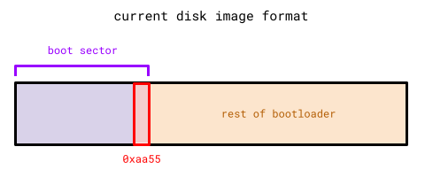
</p>

> ℹ️ **Disk Image Format Clarification:**
>
> This format will change once we start implementing a *filesystem*, which is nothing but a *disk image format specification* that makes it a lot easier to program concepts like files and directories into our operating system. Since these concepts aren't relevant right now, I'm keeping this disk image format purely for the sake of simplicity.
>
> Know that this isn't how typical operating systems format their disk image and that it will be changed once we get into filesystems.

Remember that memory in the hard disk (or any secondary storage) is *not* directly usable by the CPU and will first need to be copied into RAM (or any primary storage) to be operable. Also remember that only the first sector from the hard disk is brought into RAM for us, so we'll need to bring the rest of the sectors into RAM ourselves if we want the rest of the bootloader to be at all useful.

It's smart to dedicate the first sector to bring in the rest of the sectors to RAM: there isn't much else we can do within 512 bytes anyways.

We'll need to decide where exactly to place the rest of the bootloader in RAM. Revisiting what the machine's RAM looks like at start-up, there exists usable memory around where the first sector is loaded at `0x7c00`:

* In the last section we placed the bootloader stack *before* the first sector.
* I plan to place the rest of the bootloader directly *after* the first sector, at `0x7e00`.

<table>
    <thead>
        <tr>
            <th style="text-align: center">Start (Exclusive)</th>
            <th style="text-align: center">End (Inclusive)</th>
            <th style="text-align: center">Contents</th>
            <th style="text-align: center">Is Usable?</th>
        </tr>
    </thead>
    <tbody>
        <tr>
            <td style="text-align: center"><code>0x0</code></td>
            <td style="text-align: center"><code>0x500</code></td>
            <td style="text-align: center">BIOS Data</td>
            <td style="text-align: center">No</td>
        </tr>
        <tr>
            <td style="text-align: center"><code>0x500</code></td>
            <td style="text-align: center"><code>0x7c00</code></td>
            <td style="text-align: center">Bootloader Stack</td>
            <td style="text-align: center" rowspan="3">Yes</td>
        </tr>
        <tr>
            <td style="text-align: center"><code>0x7c00</code></td>
            <td style="text-align: center"><code>0x7e00</code></td>
            <td style="text-align: center">Bootloader's First Sector</td>
        </tr>
        <tr>
            <td style="text-align: center"><code>0x7e00</code></td>
            <td style="text-align: center"><code>0x80000</code></td>
            <td style="text-align: center">Rest of Bootloader</td>
        </tr>
        <tr>
            <td style="text-align: center"><code>0x80000</code></td>
            <td style="text-align: center"><code>0x100000</code></td>
            <td style="text-align: center">Hardware Reserved</td>
            <td style="text-align: center">No</td>
        </tr>
    </tbody>
</table>

Let's begin by reading in the rest of the bootloader into `0x7e00` in RAM from the first sector:

### Disk Reading Roadmap

Thankfully, BIOS provides a utility that loads in any specified sector into any specified location in RAM, exactly what we want. Unluckily, this utility is part of BIOS extensions that aren't supported on some *extremely old* BIOS software. However, BIOS also provides an "extension check" utility to see if extensions can be used on the machine's particular BIOS.

As responsible programmers, we'll be using this "extension check" utility so we can display a nice `Unsupported BIOS` error message instead of undefined behavior if it doesn't pass the check.

This "extension check" BIOS utility specifically is Interrupt 19 Subservice 65. Just like with BIOS's utility for printing characters, we need to specify some register value "parameters" before we invoke this interrupt.

| Register | Expected Value                      |
| :------: | ----------------------------------- |
| `ah`     | The Subservice ID - 65 in this case |
| `bx`     | Must be `0x55aa`                    |
| `dl`     | *The Disk Drive Number*             |

All these parameters are self-explanatory, besides the disk drive number:

An x86 machine has multiple secondary storage devices (including the hard disk), each with their own unique *disk drive number*. BIOS wants to know which exact secondary storage device it needs to operate with through its disk drive number.

So we need to find a way to extract the hard disk's *disk drive number*. 

Despite knowing very little about the state of hardware environment at start-up, there's a few guarantees you can rely on:

1. You can always rely on the hard disk's first sector to be loaded into `0x7c00` in RAM and executed.
2. **You can also always rely on the register `dl` to contain the hard disk's *disk drive number* at start-up.**

There's a few layers of indirection, but I'll recap for clarity:

1. We'll extract the hard disk's *disk drive number* from `dl` at start-up.
2. We'll then pass the disk drive number into BIOS's "extension check" utility.
3. Once BIOS extensions are confirmed, we'll finally use the desired BIOS utility to read sectors into RAM.

### Retrieving Disk Drive Number

Extracting the disk drive number from the non-naked `stage_1_main` function is difficult since compiler-inserted function prologues can change *any* register value. We can't trust `dl` to have the disk drive number in `stage_1_main`.

The only other option is to extract `dl`'s value from the naked `entry` function. We need to find someway to transfer `dl`'s value from `entry` (where only assembly can be written) to non-naked `stage_1_main`.

There's two ways to send information to functions externally:

1. Global variables. These will require `unsafe` blocks since we don't have any thread-safe mechanisms yet.
2. Parameters. This is the preferred option.

```Rust
fn stage_1_main(disk_drive: u8) -> ! { ... }
```

We must somehow find a way to pass in a `u8` parameter to `stage_1_main` using only assembly in the naked `entry` function.

> **Calling Conventions**
>
> In assembly, parameters can be passed any way you like, as long as the function invoker (caller) and the function itself (callee) agrees on how it's done.
>
> Different programming languages have standardizations (as part of their *calling convention*) on how parameters are passed to functions for specific architectures. This process is similar to passing register parameters before invoking BIOS interrupts.
>
> For example using C on the x86_64 architecture, the first parameter is always passed through the register `rdi`, the second in `rsi`, third in `rdx`, etc. Say the following function exists on the x86_64 architecture:
>
> ```C
> /* C syntax */
> void x86_64_func(long param_1, long param_2, long param_3);
> ```
>
> ...and we perform the following call:
>
> ```C
> x86_64_func(10, 64, 999);
> ```
> 
> This call in assembly would look roughly like:
>
> ```nasm
> mov rdi, 10
> mov rsi, 64
> mov rdx, 999
> call x86_64_func
> ```
>
> ...where parameters are set in the calling convention's standardized registers before invoking the function call. Now if `param_1` is ever used within `x86_64_func`'s function body, C's compiler will know to find it in the `rdi` register.

x86 in 16-bit mode falls under the x86_32 architecture (which captures both 16-bit and 32-bit modes of x86). C also has a calling convention for this architecture, where function parameters are pushed onto the program stack before the function call.

Take the sample x86 16-bit (x86_32 architecture) function...

```C
/* C syntax */
void x86_32_func(int param_1);
```

...and let's call it:

```C
x86_32_func(111);
```

Within the function itself (from the *callee's* perspective), it expects the program stack to be set up like:

<p align="center">
  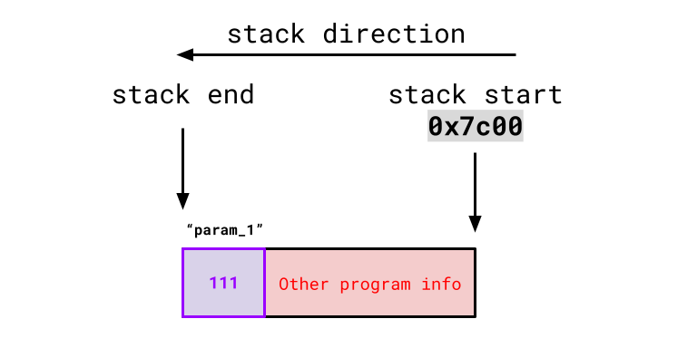
</p>

...so any time it uses `param_1` in its function body, it will look at the end of the stack for it.

So it's our responsibility from the *caller's* perspective to push or "append" the first parameter onto the stack so that the *callee* is in agreement that the first parameter is at the end of the stack.

Thankfully, there's an assembly command that does just this:

```nasm
push [src]
```

...where `[src]` is a register, and its value gets copied and pasted to the end of stack for us (accounting for stack direction).

In C's x86_32 calling convention, it expects parameters to be pushed onto the stack in 32-bit increments. This is a problem in our case since we only want to pass in `dl`, an 8-bit wide register. However, you can still get around this.

If you want to pass an 8-bit parameter in C's x86_32 calling convention, you place the 8 bits at the *lower quadrant* of a 32-bit register and push that register on the stack. If the function callee itself knows it's being passed an 8-bit parameter, it will only use the lowest 8-bits of the 32-bit value at the end of the stack (ignoring the upper 24 bits).

Thankfully, `dl` is already the 8-bit lower quadrant of the 32-bit wide register `edx` (we discuss register anatomy [here](https://sumandas27.github.io/scratchOS-Blog/ch01-03-exploring-the-machines-environment.html#processor-registers)), so we can simply push `edx` onto the stack and only its lower 8-bits (a.k.a. `dl`) will be used.

<p align="center">
  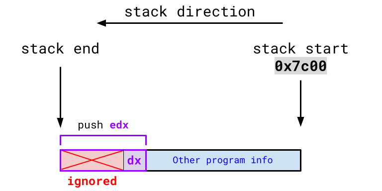
</p>

In conclusion, this is just a one-liner assembly command: `push`ing `edx` onto the stack before calling `stage_1_main`.

```Rust
#[naked]
#[no_mangle]
extern "C" fn entry() -> !
{
    unsafe { core::arch::asm!
    (
        "mov sp, 0x7c00",

        "mov ax, 0",
        "mov ds, ax",
        "mov es, ax",
        "mov fs, ax",
        "mov gs, ax",
        "mov ss, ax",

        "push edx",
        "call {main}",

        main = sym stage_1_main,
        options(noreturn)
    )}
}

/* Doesn't quite use the correct calling convention just yet */
fn stage_1_main(disk_drive: u8) -> !
{
    inf_loop()
}
```

We've done everything "caller" side. Now let's resolve the "callee" side (which thankfully isn't nearly as difficult).

There's nothing specifying which calling convention `stage_1_main` should use. Rust functions have no standardized calling convention, but we can override this and specify a calling convention that `stage_1_main` must adhere to:

> We can look at all calling conventions Rust supports through its official ABI string reference: <https://doc.rust-lang.org/reference/items/external-blocks.html#abi>.
>
> We can see that `extern "cdecl"` represents C's x86_32 calling convention.

Updating `stage_1_main`,

```Rust
extern "cdecl" fn stage_1_main(disk_drive: u8) -> !
{
    inf_loop()
}
```

The assembly "caller" code and the "callee" `stage_1_main` function agree to use C's x86_32 calling convention, where the `disk_drive` parameter is found in the last 8-bits of the 32-bit value at the end of the program stack.

Great! Let's test it: the hard disk's *disk drive number* on QEMU is always `0x80`.

```Rust
/* ❗ QEMU Only Code!
 * ------------------------------------------------------------------------------
 * The hard disk's disk drive number may not be 0x80 on other emulators/machines:
 */
extern "cdecl" fn stage_1_main(disk_drive: u8) -> !
{
    if disk_drive == 0x80
    {
        btl_print(b"Success!");
    }

    inf_loop()
}
```

Running it on QEMU:

<p align="center">
  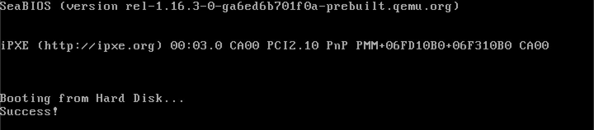
</p>

We successfully took in the disk drive number as a parameter in assembly.

### Checking for BIOS Interrupt 19 Extensions

Now, we have everything required for BIOS's interrupt 19 extension check. As a reminder, it takes in the following register parameters:

| Register | Expected Value          |
| :------: | ----------------------- |
| `ah`     | The Subservice ID - 65  |
| `bx`     | Must be `0x55aa`        |
| `dl`     | *The Disk Drive Number* |

In Rust:

```Rust
extern "cdecl" fn stage_1_main(disk_drive: u8) -> !
{
    unsafe { core::arch::asm!
    (
        "int 19",
        inout("ah") 65u8 => _,
        inout("bx") 0xaa55u16 => _,
        inout("dl") disk_drive => _
    )}

    inf_loop()
}
```

Furthermore, this interrupt will set the *carry flag* if extensions are <u>*not*</u> supported.

> ❓ **What is the *carry flag*?**
>
> The *carry flag* is one of 32 flags stored in the *status register*, a special 32-bit wide register where each bit represents a particular boolean flag (0 or 1) that aids in various computer operations.

To extract the value of the carry flag, we can use the `sbb` (**s**u**b**tract with **b**orrow) assembly command:

```nasm
sbb [dst], [src]
```

This effectively does `[dst] = [dst] - [src] - carry flag`. There's a neat trick we can use if we set `[dst]` and `[src]` to the same register, something like:

```nasm
sbb cx, cx
```

Then, `cx` will be `0` if the carry flag isn't set, and `-1` if it is set. Rust's inline assembly allows us to extract the value of registers into local variables:

```Rust
/* Sample Rust code to extract whether or not the carry flag is set 
 * ----------------------------------------------------------------
 */
let sbb_carry_flag_value: i16;
unsafe { core::arch::asm!
(
    "sbb cx, cx"
    out("cx") sbb_carry_flag_value
)}

if sbb_carry_flag_value != 0
{
    // carry flag is set
}
```

Before, we've only seen the `out` command used with just an underscore `_` which restores the register's previous state. Supplying a variable will *additionally* store the register's final value (before the revert) to the variable.

Combining this with the BIOS interrupt call, we have:

```Rust
let sbb_carry_flag_value: i16;
unsafe { core::arch::asm!
(
    "int 19",
    "sbb cx, cx",
    inout("ah") 65u8 => _,
    inout("bx") 0xaa55u16 => _,
    inout("dl") disk_drive => _,
    out("cx") sbb_carry_flag_value
)}

if sbb_carry_flag_value != 0
{
    btl_print(b"BIOS Ext Not Supported!");
    inf_loop();
}
```

> I chose to use `cx`, but any register works. You can optionally have the compiler select an intermediate register for you:
>
> ```Rust
> let sbb_carry_flag_value: i16;
> unsafe { core::arch::asm!
> (
>     "int 19",
>     "sbb {sbb_reg:x}, {sbb_reg:x}",
>     sbb_reg = out(reg) sbb_carry_flag_value
>     inout("ah") 65u8 => _,
>     inout("bx") 0xaa55u16 => _,
>     inout("dl") disk_drive => _
> )}
> ```
>
> Previously, we've only seen the `in` and `out` command used with *explicit registers*. `reg` is one of the many *register class* in which the compiler gets to choose any register from that class (rather than us supplying an explicit register).
>
> You can find information on *register classes* in The Rust Reference: <https://doc.rust-lang.org/reference/inline-assembly.html#register-operands>
>
> `sbb_reg` is a *template string*, just like `main` in the naked `entry` function (you can name these whatever you want). In this case, we tell the compiler to replace the `sbb_reg` template string with a register of its choice from the `reg` register class.
>
> ❓ **What is the `:x` in front of `{sbb_reg}`?**
>
> When the compiler gets to choose a register, it will choose a 32-bit wide register by default. Notice how this register outputs to a variable of type `i16` or 16-bits wide: this is incompatible!
>
> Adding an `:x` in front of `{sbb_reg}` tells the compiler to *format* its selected register as its *16-bit alias*. 
>
> For example, if it selected the register `ecx` (32 bits wide), adding `:x` would tell the compiler to format the register as its *16-bit alias* `cx` instead, which is compatible with the 16-bit wide output variable.

If extensions aren't supported, we can stop the program here with an `inf_loop` since it's required to make further progress.

### Setting Up a Disk Address Packet Structure

Now, we can continue with the main BIOS utility that reads sectors to RAM. This utility is Subservice 66 of Interrupt 19 and takes in the following register parameters:

| Register | Expected Value                   |
| :------: | -------------------------------- |
| `ah`     | The Subservice ID - 66           |
| `dl`     | The Disk Drive Number            |
| `si`     | Address of *Disk Address Packet* |

> `si` is a 16-bit wide register generally used to store memory addresses.

Additionally, BIOS will populate the `ah` register with a *return code*, where 0 represents a successful load and anything else is an error code.

The *disk address packet* is a structure that contains all information BIOS needs for this interrupt. It's formatted as follows:

| Size  | Description                                           |
| :---: | ----------------------------------------------------- |
| `u8`  | Disk Address Packet Structure Size - 16 in this case  |
| `u8`  | Always 0                                              |
| `u16` | Number of sectors to transfer                         |
| `u32` | Where to place in RAM?                                |
| `u64` | Which sector index to start reading from?             |

Let's write this in Rust:

```Rust
#[repr(C, packed)]
struct DiskAddressPacket
{
   dap_size:                u8,
   always_zero:             u8,
   sectors_to_transfer:     u16,
   ram_start:               u32,
   sector_start:            u64
}
```

> ❓ **What is `#[repr(C, packed)]`?**
>
> The `repr` attribute changes the memory layout of Rust `struct`s. 
>
> By default, the compiler can order `struct` fields in *any* way including orders different from the one specified in the `struct` declaration. Additionally, Rust's compiler may add *any* amount of padding/space between `struct` fields to optimize their memory accesses. 
>
> However, BIOS expects disk address packets to be layed out *exactly* in the order specified and with *no* padding between fields.
>
> * `#[repr(C)]` forces a Rust `struct` to follow how C handles its `struct`s, where fields are placed exactly in the order specified.
> * `#[repr(packed)]` guarantees no padding/space insertions between `struct` fields.
>
> We can combine these 2 `repr`s with `#[repr(C, packed)]`.

Since the first 2 fields of `DiskAddressPacket` will always be the same, let's write a constructor that takes in only the last 3 fields as parameters:

```Rust
impl DiskAddressPacket
{
    fn new(sectors_to_transfer: u16, ram_start: u32, sector_start: u64) -> Self
    {
        return Self
        {
            dap_size:               core::mem::size_of::<Self>() as u8,
            always_zero:            0,
            sectors_to_transfer:    sectors_to_transfer,
            ram_start:              ram_start,
            sector_start:           sector_start
        };
    }
}
```

> `DiskAddressPacket` takes up 16 bytes of space, so you can just set the `dap_size` field to `16`, but I like to be more verbose and use Rust's `size_of` function from its Core Library.

Let's take a look at each of these parameters:

* `sectors_to_transfer`: This will depend on how large the rest of our bootloader is. To clarify, this interrupt will *only* load the 2<sup>nd</sup> bootloader stage for now.

    Similar to how stage 1's `.magic_number` link section prevents it from ever exceeding 512 bytes in size, we can make memory constraints for the 2<sup>nd</sup> and 3<sup>rd</sup> bootloader stages. In this blog, my plan is...

    | Bootloader Stage | RAM Start | RAM End   |
    | :--------------: | :-------: | :-------: |
    | 2nd Stage        | `0x7e00`  | `0x9000`  |
    | 3rd Stage        | `0x9000`  | `0x10000` |

    This will make the stage 2 bootloader 4608 bytes or <u>**9**</u> sectors large.

* `ram_start`: We want to load the rest of the bootloader to `0x7e00`.
* `sector_start`: Thinking of the hard disk as an array of sectors, index <u>**1**</u> is where the 2<sup>nd</sup> bootloader stage begins.

Let's construct a `DiskAddressPacket` on the stack:

```Rust
const STAGE_2_START: u16 = 0x7e00;
const STAGE_2_END: u16 = 0x9000;
const SECTOR_LENGTH: u16 = 512;
let dap = DiskAddressPacket::new((STAGE_2_END - STAGE_2_START) / SECTOR_LENGTH, STAGE_2_START as u32, 1);
```

> 💡 Try defining your numbers as much as possible, raw numbers are unreadable! 

Now, we have everything we need to invoke the interrupt:

```Rust
let load_return_code: u8;
unsafe { core::arch::asm!
(
    "int 19",
    inout("ah") 66u8 => load_return_code,
    inout("dl") disk_drive => _,
    inout("si") &dap as *const _ as u16 => _
)}

if load_return_code != 0
{
    btl_print(b"Rest of Btl Load Failed");
    inf_loop();
}
```

`&dap as *const _ as u16` is how you can get the address of the stack-allocated disk address packet as a `u16`. Running this code, we see:

<p align="center">
  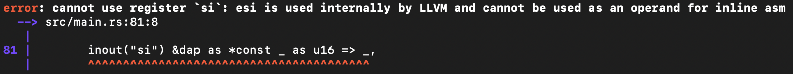
</p>

Tragic. But, we are allowed to set `si` manually within the assembly routine. We just need to be *extra* careful to preserve its state for LLVM, and we can do so through the program stack.

As seen before, the `push` assembly command adds bytes to the end of the stack, there also exists the inverse `pop` command which removes bytes from the stack:

```nasm
pop [dst]
```

`[dst]` is a register where the removed bytes will be stored.

Using `push` and `pop` in conjunction, we can preserve the state of `si`:

1. Before `si` is edited, `push` the old value of `si` onto the stack. 
2. Make any necessary edits to `si`.
3. `pop` the old value back into the register.

<p align="center">
  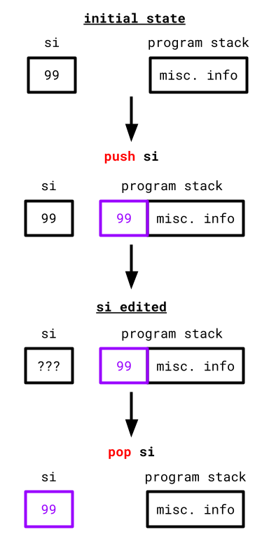
</p>

In Rust:

```Rust
let load_return_code: u8;
unsafe { core::arch::asm!
(
    "push si",
    "mov si, {addr:x}",
    "int 19",
    "pop si",
    addr = inout(reg) &dap as *const _ as u16 => _,
    inout("ah") 66u8 => load_return_code,
    inout("dl") disk_drive => _
)}
```

We preserve the contents of `si`, and set its value via. an intermediate compiler-selected 16-bit wide register before the interrupt.

### Jumping to `0x7e00` in RAM

Hypothetically, the 2<sup>nd</sup> bootloader stage (which doesn't exist yet) is now loaded at `0x7e00`. Let's jump to it using the help of our linker script:

```
ENTRY(entry)

SECTIONS
{
    ...

    . = 0x7c00 + 510;
    .magic_number :
    {
        SHORT(0xaa55)
    }

    stage_2_main = .;
}
```

Recall that the `.` character is the linker script's *location counter*. It is set to `0x7c00 + 510`. Since the `.magic_number` link section is 2 bytes wide, the location counter is then updated to `0x7c00 + 510 + 2 = 0x7e00`. We then place a new "label" `stage_2_main` to the location counter at `0x7e00`. 

Essentially we make a "promise" to Rust's linker, telling it that a function exists at `0x7e00`.

We can extract/import this "promised" function Rust-side by using an `extern` block at the top of the bootloader code:

```Rust
#![no_std]
#![no_main]
#![feature(naked_functions)]

extern "Rust"
{
    fn stage_2_main() -> !;
}

...
```

This makes the compiler look for a label named `stage_2_main` in the linker script. Since it's defined at `0x7e00`, Rust's compiler will interpret `stage_2_main` as a <u>Rust</u> non-returning function (from the `extern` block) at `0x7e00` (from the linker script).

> The `extern` block by default assumes the use of C's calling convention which is why `extern "Rust"` is specified so that `stage_2_main` is treated as a Rust function rather than a C function.

Then, we can simply invoke a call to this "promised" function, replacing the infinite loop:

```Rust
extern "cdecl" fn stage_1_main(disk_drive: u8) -> !
{
    ...

    unsafe { stage_2_main() }
}
```

The compiler blindly follows our promise of a function at `0x7e00` regardless of if a function is actually there or not, hence the `unsafe` block.

### Creating the Stage 2 Bootloader

This is where we fulfill our end of the promise.

Let's copy and paste the `stage_1` Rust project and rename it to `stage_2`:

```
scratch_os
├── bootloader
│   ├── stage_1
│   │   └── ...
│   └── stage_2
│       └── ...
└── kernel
```

There's only a few changes to be made. Beginning with the `Cargo.toml` file:

* This doesn't change anything, but I'd change the package name to `stage_2` instead of the old `stage_1`.

Let's change the linker script:

* We'll keep the function naming consistent and name stage 2's entry function to `stage_2_main`: 

    ```Linker Script
    ENTRY(stage_2_main)
    ```

* We want `stage_2_main` to be placed at `0x7e00`, so we'll initially set the location counter to `0x7e00`:

    ```Linker Script
    . = 0x7e00;
    ```

* For the actual function placement, we'll place `stage_2_main` to be generated first within the `.text` section:

    ```Linker Script
    .text :
    {
        *(.text.stage_2_main)
        *(.text .text.*)
    }
    ```

* Since the `0xaa55` magic number is only relevant to the first sector, we can get rid of the `.magic_number` link section.

* We also want to make sure `stage_2` is extended to `0x9000`. Our BIOS interrupt may fail if we request more sectors to load than what exists on the hard disk. We can do this by simply adding some null bytes at `0x9000`, similar to `stage_1`'s `.magic_number` link section:

    ```Linker Script
    . = 0x9000 - 2;
    .stage_2_end_bytes :
    {
        SHORT(0x0000)
    }
    ```

Recall that the `SHORT` keyword inserts 2 bytes, extending `stage_2` to end exactly at `0x9000`.

At this point, the stage 2 bootloader's linker script is condensed to:

```Linker Script
ENTRY(stage_2_main)

SECTIONS
{
    . = 0x7e00;
    .text :
    {
        *(.text.stage_2_main)
        *(.text .text.*)
    }

    . = 0x9000 - 2;
    .stage_2_end_bytes :
    {
        SHORT(0x0000)
    }
}
```

We then define `stage_2_main` in `main.rs`:

```Rust
#![no_std]
#![no_main]

#[no_mangle]
fn stage_2_main() -> !
{
    btl_print(b"Hello from stage 2!");
    inf_loop()
}

/* ❗ Don't forget your panic handler!
 * -----------------------------------
 */
#[panic_handler]
fn panic(_: &core::panic::PanicInfo) -> !
{
    loop {}
}
```

> ⚠️ **`btl_print` and `inf_loop` are defined twice in `stage_1` and `stage_2`!**
>
> Code duplication should be avoided as much as possible. I create a `common` Rust library crate that contains any code used in multiple components of this project (bootloader stages or the kernel). 
>
> I implement and document this `common` library crate under `scratch_os-blog-src/ch01-04-src` within this blog's [GitHub Repository](https://github.com/sumandas27/scratchOS-Blog), I recommend following this approach.
>
> * You can create a new library crate with the terminal command:
> 
> ```properties
> cargo new <crate_name> --lib
> ``` 
> 
> * You allow binary crates (like the `stage_1` and `stage_2` crates) to use library code by adding the library as a dependency in the binary crate's `Cargo.toml` file.

Now, we need to convert this new `stage_2` project into a raw binary. This process is identical to `stage_1`. 

In a shell script:

```properties
cd bootloader/stage_2/
cargo build --release
cd target/<name_of_your_json_file>/release/
objcopy -I elf32-i386 -O binary stage_2 stage_2.bin
```

...or equivalent Rust code if you use Rust for your automatic runner.

### Finishing the Disk Image

We now have two raw binary files: `stage_1.bin` and `stage_2.bin`. 

* `stage_1.bin` represents the disk image's first sector. 
* `stage_2.bin` represents the "rest of the bootloader".

It's time to merge these into one final disk image to run on QEMU. Let's first start by creating an empty file named `disk_image.iso`. 

If your runner code is in Rust:

```Rust
// Creates an empty `disk_image.iso` file
let mut disk_image_iso = std::fs::OpenOptions::new()
    .read(true)
    .write(true)
    .create(true)
    .truncate(true)
    .open("<path to your disk image>/disk_image.iso")
    .expect("Could not open the disk image!");
```

> ❓ **What is the `.iso` format?**
>
> The `.iso` format is typically used for files meant to represent entire secondary storage devices. In our case, `disk_image.iso` represents the machine's hard disk.

This is how I envision the disk image to be created:

<p align="center">
  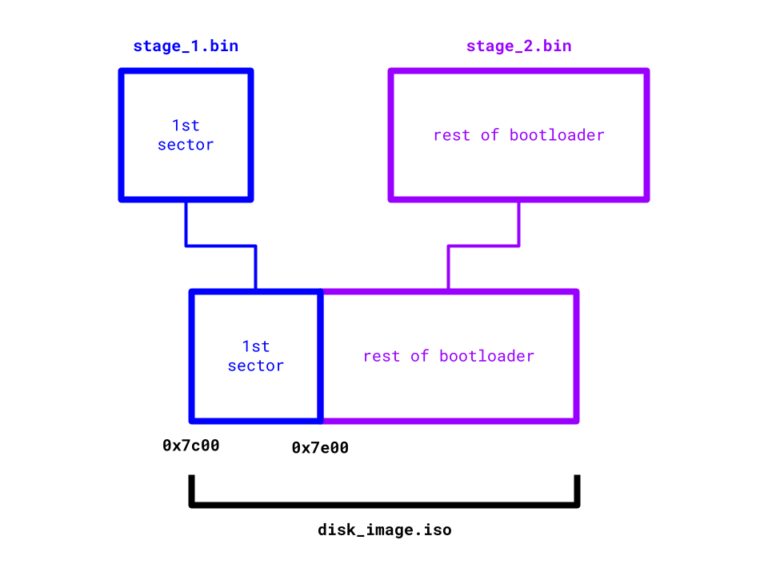
</p>

There's a lot of moving parts here:

* At the very start, BIOS will load the first sector (`stage_1`), to `0x7c00` in RAM. At this point, *only* `stage_1` exists in RAM, and `stage_2` will still be on the disk.

<p align="center">
  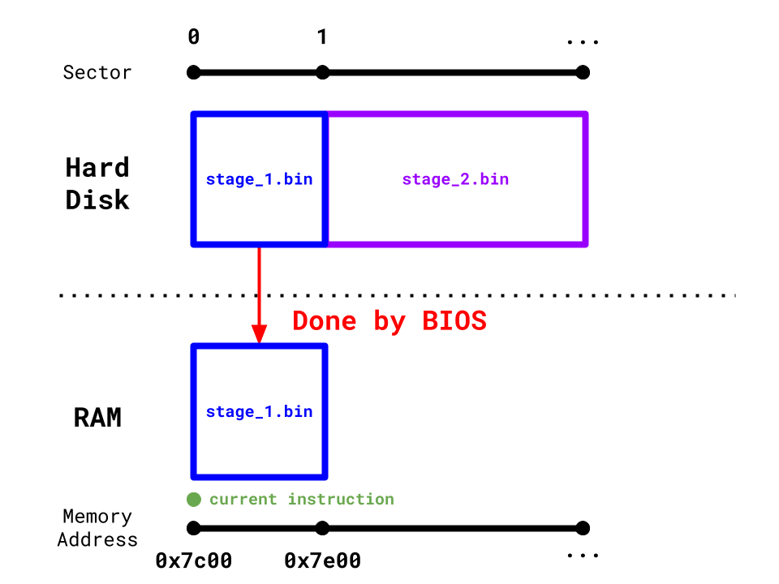
</p>

* The code within `stage_1` is then responsible for loading `stage_2` into RAM at `0x7e00`.

<p align="center">
  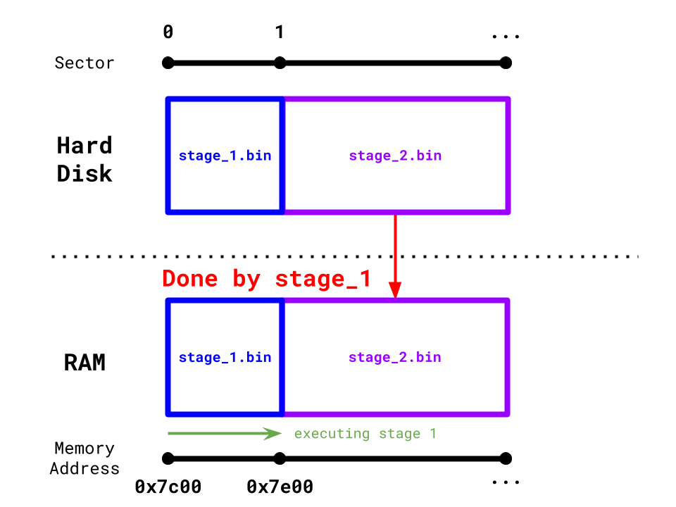
</p>

* `stage_1` then jumps to `0x7e00`, where `stage_2` places its `stage_2_main` function. Code execution successfully continues in `stage_2_main` (theoretically).

<p align="center">
  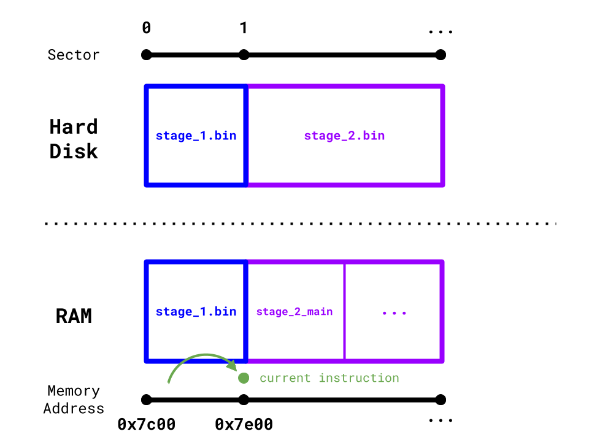
</p>

So all we really need to do is add `stage_1.bin` to the currently empty `disk_image.iso`, and then directly append `stage_2.bin`. This will give us the desired `disk_image.iso` structure. You can use the `dd` command to accomplish this if you use a Makefile or shell script. 

In Rust:

```Rust
// create a handle to `stage_1.bin`
let mut stage_1_bin = std::fs::File::open("<path to your stage_1.bin>/stage_1.bin")?;

// create a handle to `stage_2.bin`
let mut stage_2_bin = std::fs::File::open("<path to your stage_2.bin>/stage_2.bin")?;

// append `stage_1.bin` to `disk_image.iso`
std::io::copy(&mut stage_1_bin, &mut disk_image_iso)?;

// append `stage_2.bin` to `disk_image.iso`
std::io::copy(&mut stage_2_bin, &mut disk_image_iso)?;
```

Let's run our newly created `disk_image.iso` on QEMU:

```properties
qemu-system-x86_64 -drive format=raw,file=<path to your disk image>/disk_image.iso
```

You will see one of two results:

* If you <u>didn't</u> create a `common` library crate to store shared functions (not my recommendation), you should have successfully seen `Hello from stage 2!`

<p align="center">
  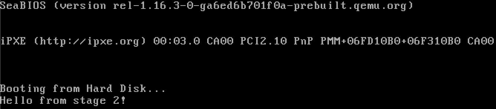
</p>

* However, there can be complications if you did create one (which is my recommendation since you get to not wastefully duplicate your code) and see this:

<p align="center">
  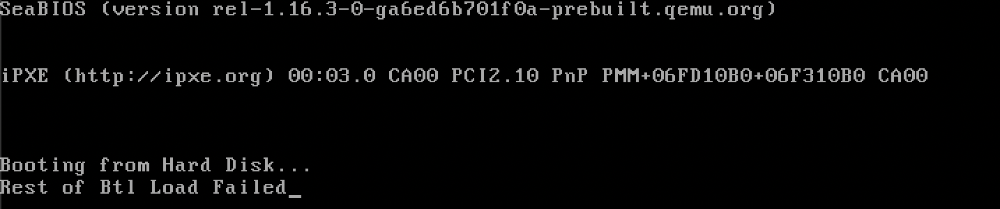
</p>

> 🆘 **What do I do if I created a `common` library crate? Is it over?**
>
> No, but the issue is pretty hard to spot: the process of linking the library crate with our bootloader projects necessitated the linker to generate new link sections that we haven't mapped yet.
>
> We talk about link sections [here](https://sumandas27.github.io/scratchOS-Blog/ch01-02-writing-a-boot-sector.html#placing-the-entry-point) in case you want a refresher.
>
> In our case, `stage_1` additionally generates the `.rodata` link section. If a link section is left unmapped, the linker is free to place it wherever. In this case, the `.rodata` section gets placed *before* `.text`, and we can verify this by reusing the `readelf` tool:
>
> <p align="center">
>   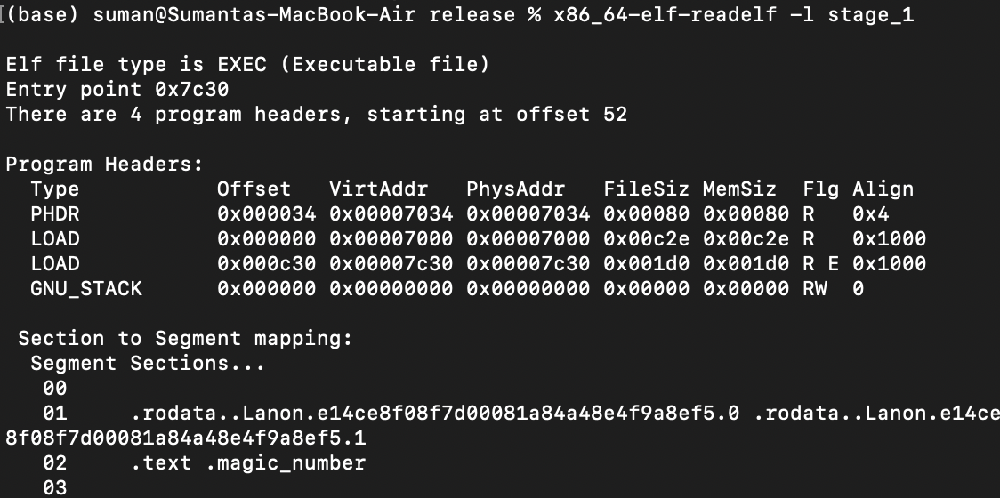
> </p>
> 
> Notice how it lists `.rodata` generated subsections *before* the `.text` section. Also notice how the entry point is now at `0x7c30` and not `0x7c00`, being displaced by `.rodata`. This means when the CPU starts execution at `0x7c00`, it reinterprets memory in `.rodata` as computer instructions: all bets are off on what the machine does at this point. 
> 
> We can mitigate this by mapping the generated `.rodata` sections/subsections to be *after* `.text` in the linker script:
> 
> ```Linker Script
> SECTIONS
> {
>     . = 0x7c00;
>     .text :
>     {
>         *(.text.entry)
>         *(.text .text.*)
>     }
> 
>     .rodata :
>     {
>         *(.rodata .rodata.*)
>     }
> 
>     ...
> }
> ```
> 
> Let's rerun `readelf` to confirm that `.text` is correctly placed at the start of the binary:
> 
> <p align="center">
>   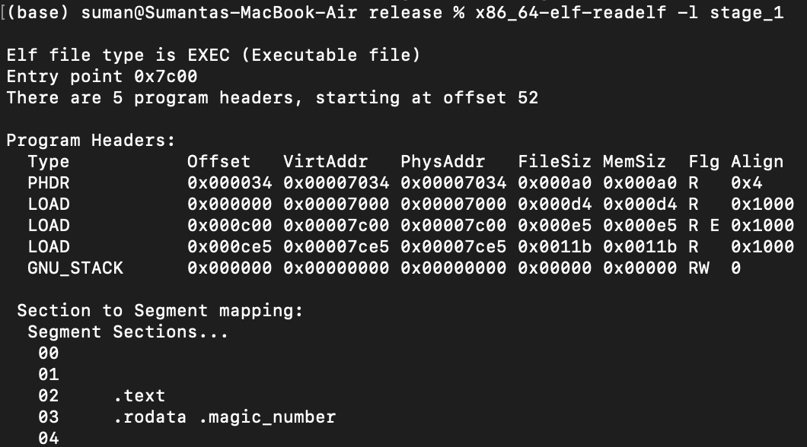
> </p>
> 
> Perfect!
>
> Unfortunately, new `.rodata` link subsection generation also happened with `stage_2` (since it also uses the library crate), so <u>repeat the mapping process</u> with `stage_2` to ensure that the new `.rodata` is placed *after* `.text`.
> 
> Now with all link sections correctly ordered, let's rerun our program:
>
> <p align="center">
>  
> </p>
>
> We ballin.

Our stage 1 bootloader is complete 😊! In other words, we have escaped the constricting 512-byte memory restriction and can now do so much more. 

We'll begin writing our stage 2 bootloader in the next chapter.

**TODO: have to set `ds` to `0` during dap creation**
**TODO: talk about string length and executable size**
**TODO: link section fix not just based on library crate. talk about potential `.got` and other sections (check for 512 even if shows after `.magic_number`)**
**TODO: Split into 2 sections**